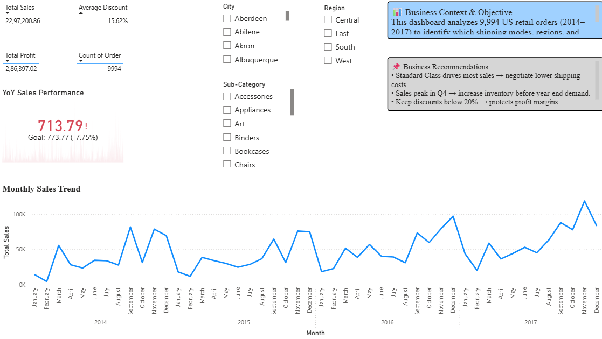
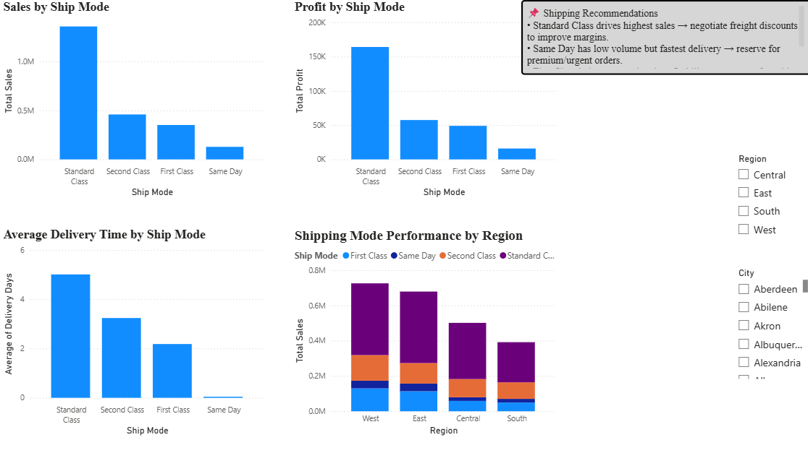
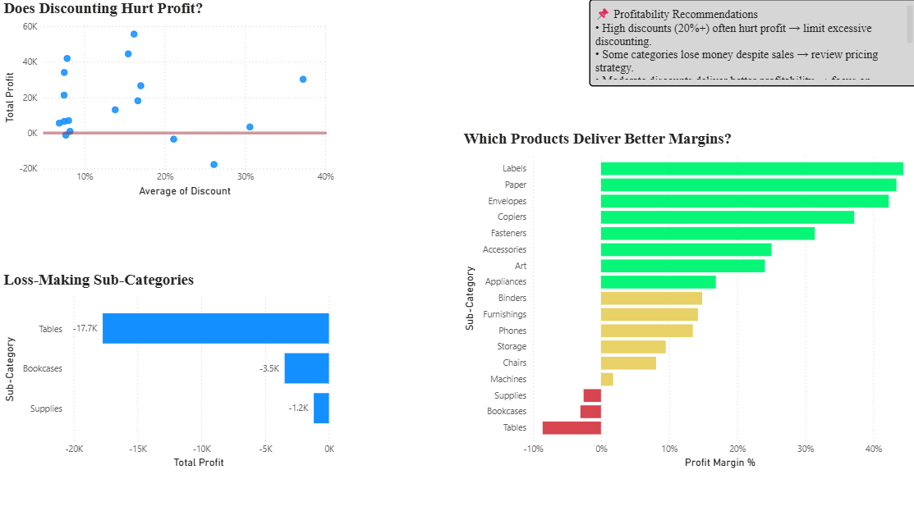
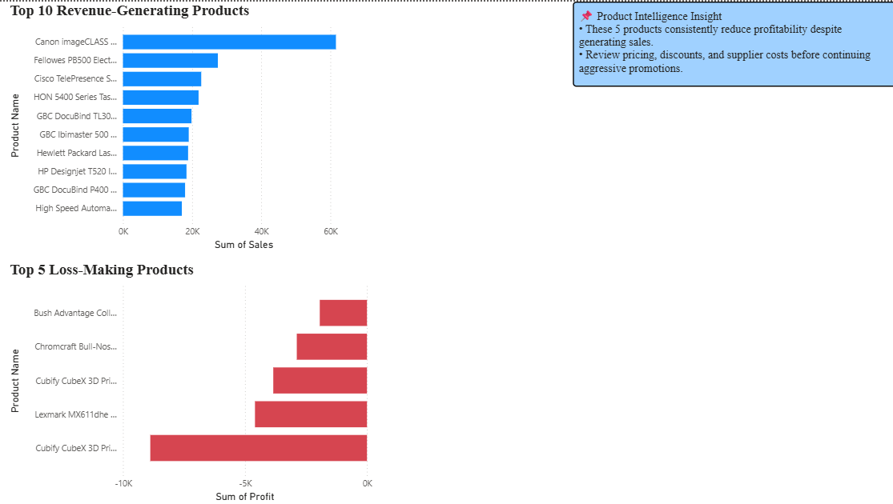

# Sales Performance Dashboard


## Project Overview

This project analyzes **9,994 US retail orders (2014–2017)** to identify which shipping modes, regions, products, and discount strategies drive business growth — and where profitability is being eroded.

The dashboard transforms raw retail transaction data into actionable business insights using **Excel, Power BI, and DAX**, helping decision-makers optimize pricing, logistics, and product performance.

---

## Problem Statement

Retail businesses often prioritize revenue growth without fully understanding how shipping methods, discounts, and product mix affect profitability.

This dashboard identifies **sales drivers, loss-making areas, profitability risks, and operational inefficiencies** to support smarter business decisions.

---

## Tools & Technologies Used

| Tool                            | Purpose                                            |
| ------------------------------- | -------------------------------------------------- |
| Microsoft Excel                 | Data cleaning, preprocessing, and analysis         |
| Power BI                        | Interactive dashboard creation and storytelling    |
| DAX (Data Analysis Expressions) | KPI development and time-intelligence calculations |
| Data Visualization              | Executive-level business reporting                 |

---

## Dashboard Pages

### 1. Executive Dashboard

Provides a high-level overview of business performance including:

* Total Sales
* Total Profit
* Average Discount
* Total Orders
* YoY Sales Performance
* Monthly Sales Trend
* Region, City & Sub-Category Filters



---

### 2. Shipping Insights

Analyzes shipping performance across the business:

* Sales by Shipping Mode
* Profit by Shipping Mode
* Average Delivery Time
* Region-wise Shipping Performance



---

### 3. Profitability Insights

Focuses on profitability risks and discount impact:

* Discount vs Profit Relationship
* Loss-Making Sub-Categories
* Profit Margin % by Sub-Category
* Discount Risk Analysis



---

### 4. Product Intelligence

Identifies top-performing and risky products:

* Top 10 Revenue-Generating Products
* Bottom 5 Loss-Making Products
* Product-Level Profitability Insights



---

## Key Findings

### 1. Shipping Performance

* **Standard Class generated approximately $1.36M (≈59%) of total sales**, making it the strongest revenue-generating shipping mode.
* Despite slower delivery times, it delivered the **highest profit contribution**, indicating strong cost efficiency.

### 2. Discount Impact on Profitability

* **Discounts above 20% frequently resulted in negative profitability**, while discounts below 10% maintained healthier margins.
* Over-discounting emerged as one of the biggest contributors to profit erosion.

### 3. Loss-Making Product Sub-Categories

* **Tables generated approximately $206K in sales but recorded nearly −$17K profit**, revealing a major profitability issue.
* **Bookcases and Supplies** also showed recurring negative profit trends despite generating sales.

### 4. Sales Growth Trend (2014–2017)

* A **YoY Sales Growth KPI** was built using DAX time-intelligence functions to monitor business performance across four years.
* **2017 recorded the strongest business momentum**, showing continued sales growth.

---

## DAX Measures Implemented

### Delivery Days

```dax
Delivery Days =
DATEDIFF('Raw Data'[Order Date], 'Raw Data'[Ship Date], DAY)
```

### Profit Margin %

```dax
Profit Margin % =
DIVIDE(
    SUM('Raw Data'[Profit]),
    SUM('Raw Data'[Sales]),
    0
)
```

### Sales Last Year (YoY Analysis)

```dax
Sales LY =
CALCULATE(
    [Total Sales],
    SAMEPERIODLASTYEAR('Raw Data'[Order Date])
)
```

### YoY Growth %

```dax
YoY Growth % =
DIVIDE(
    [Total Sales] - [Sales LY],
    [Sales LY],
    0
)
```

---

## Business Recommendations

### Sales Team — Cap Discounts at 20%

Discounting above the 20% threshold significantly hurts profitability. A discount cap can reduce unnecessary margin loss while maintaining healthy order volume.

### Logistics Team — Optimize Standard Class Freight Costs

Since **Standard Class contributes the highest sales and profit**, renegotiating freight contracts offers the highest leverage for logistics cost reduction.

### Product Team — Reprice or Reposition Loss-Making Products

**Tables, Bookcases, and Supplies** should be reviewed for pricing, bundling, or discount optimization to reduce recurring losses.

---

## Business Outcome

This dashboard shifts decision-making from **revenue-only thinking to profit-focused thinking**.

### Potential Business Impact

* Reduced losses from excessive discounting
* Better shipping profitability optimization
* Faster identification of loss-making products
* Stronger data-driven pricing and inventory decisions

---

## How to Open the Project

1. Clone or download this repository.
2. Open `Retail_Sales_Dataset.xlsx` inside the `dataset/` folder.
3. Open `Retail_Sales_Profitability_Dashboard.pbix` inside the `powerbi-dashboard/` folder using **Power BI Desktop**.
4. Click **Refresh** if prompted.

---

## Repository Structure

```text
Sales-Performance-Dashboard/
│── README.md
│
├── dataset/
│   ├── Retail_Sales_Dataset.csv
│   └── Retail_Sales_Dataset.xlsx
│
├── powerbi-dashboard/
│   └── Retail_Sales_Profitability_Dashboard.pbix
│
├── screenshots/
│   ├── executive-dashboard.png
│   ├── shipping-insights.png
│   ├── profitability-insights.png
│   └── product-intelligence.png
```

---

## Skills Demonstrated

`Power BI` `DAX` `Microsoft Excel` `Business Analysis` `Data Visualization` `KPI Development` `Time Intelligence` `Profit Margin Analysis` `Dashboard Design` `Business Storytelling`

---

## Author

**Namit More**
Aspiring Business Analyst | Data Analytics Enthusiast
