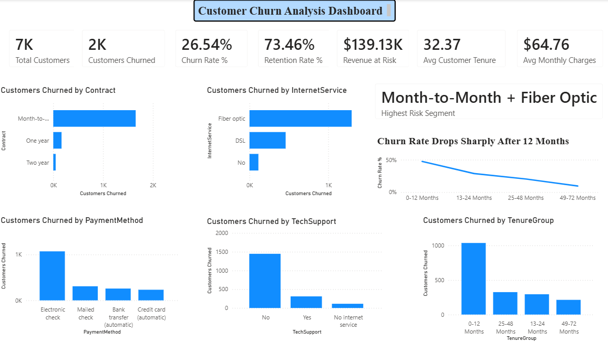
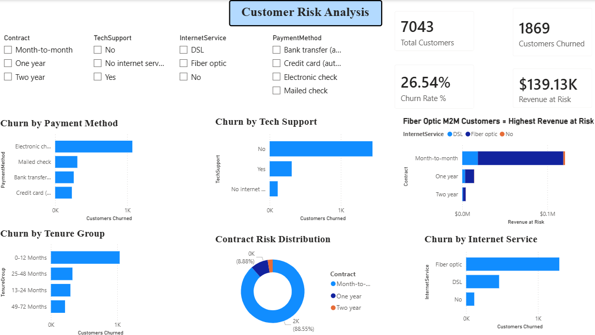
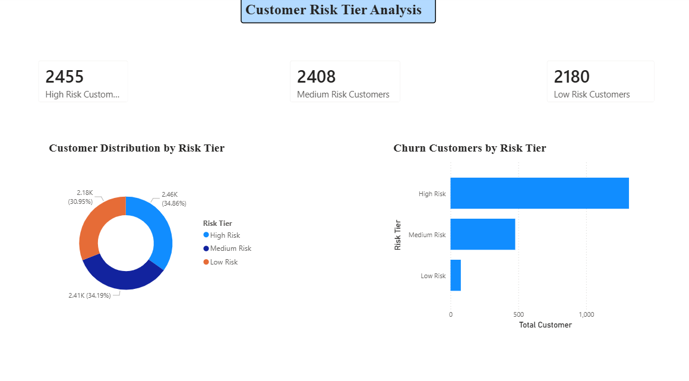
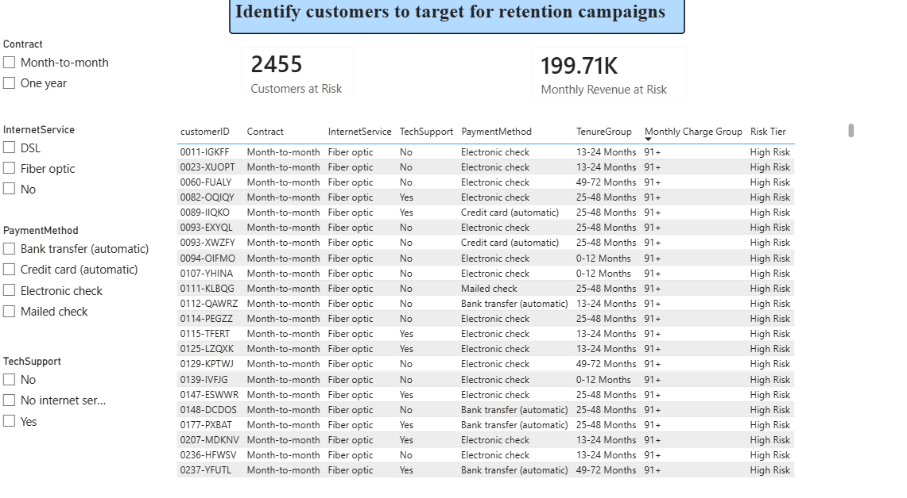
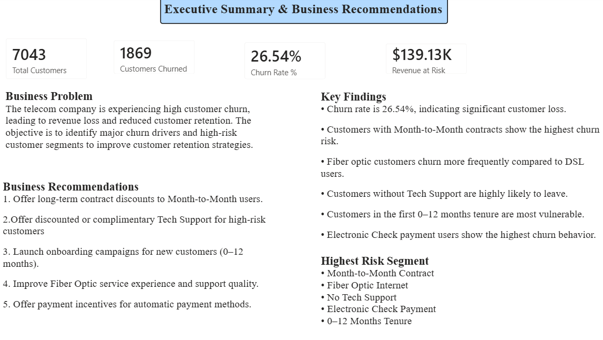

# 📊 IBM Telecom Customer Churn Analysis

> **End-to-end Business Analysis & Data Analytics project** focused on identifying churn drivers, quantifying revenue risk, and delivering actionable retention strategies using **Excel, SQL, and Power BI**.

---

## 🔍 Project Overview

Customer churn is one of the most significant challenges in the telecom industry, directly impacting customer lifetime value, revenue stability, and acquisition costs. This project analyses **7,043 telecom customers** to answer three critical business questions:

1. **Who is churning?** — Identify high-risk customer segments
2. **Why are they churning?** — Validate churn drivers using data analysis
3. **What should the business do?** — Deliver quantified and actionable business recommendations

This project follows a complete **Business Analysis lifecycle** — from stakeholder requirements and KPI planning through exploratory analysis, hypothesis validation, dashboard development, and executive reporting.

### 🎯 Project Outcome

The analysis identified a high-risk churn segment (**Month-to-Month + Fiber Optic + No Tech Support + Electronic Check + Low Tenure**) contributing disproportionately to customer churn and monthly revenue risk.

---

## 📁 Repository Structure

```text
Customer-Churn-Analysis/
│
├── dataset/
│   ├── WA_Fn-UseC_-Telco-Customer-Churn.csv
│   ├── IBM_Telecom_Customer_Churn.csv
│   └── IBM_Telecom_Customer_Churn_Analysis.xlsx
│
├── sql-analysis/
│   ├── churn_analysis.sql
│   ├── SQL_Query_Results.xlsx
│   ├── SQL_Insights.md
│   └── SQL_Screenshots/
│
├── powerbi-dashboard/
│   └── IBM_Telecom_Customer_Churn_Analysis.pbix
│
├── project-notes/
│   ├── 01_Business_Problem.md
│   ├── 02_Stakeholder_Requirements.md
│   ├── 03_KPI_Planning.md
│   ├── 04_Hypothesis_and_Findings.md
│   └── 05_Executive_Summary.md
│
├── screenshots/
│   ├── executive-overview.png
│   ├── customer-risk-analysis.png
│   ├── customer-risk-tiers.png
│   ├── high-risk-customers.png
│   └── executive-summary.png
│
└── README.md
```

---

## 📦 Dataset

| Attribute       | Details                                                                             |
| --------------- | ----------------------------------------------------------------------------------- |
| **Source**      | IBM Telecom Customer Churn Dataset                                                  |
| **Records**     | 7,043 customers                                                                     |
| **Fields**      | Customer demographics, contracts, internet services, billing, churn status          |
| **Key Columns** | CustomerID, Contract, InternetService, PaymentMethod, MonthlyCharges, Tenure, Churn |

---

## 🛠️ Tools & Technologies

| Tool                | Purpose                                                             |
| ------------------- | ------------------------------------------------------------------- |
| **Microsoft Excel** | Data cleaning, pivot analysis, feature engineering, churn modelling |
| **SQL (SQLite)**    | Customer churn analysis and segmentation                            |
| **Power BI**        | Interactive dashboards and KPI reporting                            |
| **DAX**             | KPI calculations and business measures                              |
| **Markdown**        | Business analysis documentation                                     |

---

## 🔄 Project Workflow

1. Business Problem Definition
2. Stakeholder Requirement Analysis
3. KPI Planning & Measurement Design
4. Data Cleaning & Feature Engineering (Excel)
5. SQL Analysis & Segmentation
6. Exploratory Data Analysis (Excel Pivots)
7. Hypothesis Validation
8. Customer Risk Scoring Model
9. Power BI Dashboard Development (**5 Pages**)
10. Executive Recommendations & Business Case

---

## 📊 Dashboard Pages

### Page 1 — Executive Overview

High-level KPI dashboard including total customers, churn rate, retention rate, revenue at risk, and churn segmentation by contract type, internet service, payment method, and tenure.

### Page 2 — Customer Risk Analysis

Interactive dashboard allowing analysis of churn by customer segment using slicers and filters.

### Page 3 — Customer Risk Tiers

Risk classification dashboard categorising customers into **High, Medium, and Low Risk** groups using churn indicators.

### Page 4 — High Risk Customers

Detailed customer-level retention dashboard with slicers and a customer table designed for targeted retention campaigns.

### Page 5 — Executive Summary

Management-level summary dashboard showing business insights, validated hypotheses, key findings, and recommendations.

---

## 📸 Dashboard Preview

### Executive Overview



### Customer Risk Analysis



### Customer Risk Tiers



### High Risk Customers



### Executive Summary



---

## 📐 Key DAX Measures

```dax
Churn Rate % =
DIVIDE([Customers Churned], [Total Customers])

Retention Rate % =
1 - [Churn Rate %]

Revenue at Risk =
CALCULATE(
    SUM(MonthlyCharges),
    Churn = "Yes"
)

Average Monthly Charges =
AVERAGE(MonthlyCharges)

Average Customer Tenure =
AVERAGE(Tenure)
```

---

## 🔑 Key Findings

| # | Finding                                              | Data Point                                      |
| - | ---------------------------------------------------- | ----------------------------------------------- |
| 1 | Overall churn rate is critically high                | **26.54%** churn rate across 7,043 customers    |
| 2 | Month-to-Month contracts drive the majority of churn | **1,655 churned customers**                     |
| 3 | Fiber Optic customers churn the most                 | **1,297 churned customers**                     |
| 4 | First-year customers are highest risk                | **47.44% churn in 0–12 months**                 |
| 5 | Customers with bundled services churn less           | **3+ services significantly reduce churn risk** |
| 6 | Electronic Check users show highest churn            | **1,071 churned customers**                     |
| 7 | Revenue at risk identified                           | **$139.13K monthly revenue at risk**            |

---

## 💡 Business Recommendations

| Priority  | Recommendation                                                                        | Expected Business Impact                                                                                       |
| --------- | ------------------------------------------------------------------------------------- | -------------------------------------------------------------------------------------------------------------- |
| 🔴 High   | Convert Month-to-Month customers to longer contracts through discounts and incentives | Retaining **15% of 1,655 M2M churners (248 customers)** could recover approximately **$192.7K annual revenue** |
| 🔴 High   | Improve onboarding and engagement for 0–12 month customers                            | Retaining **15% of 1,037 early-tenure churners** could recover approximately **$121.2K annual revenue**        |
| 🟡 Medium | Bundle Tech Support and security services for Fiber Optic users                       | Retaining **15% of 1,446 unsupported churners** could recover approximately **$168.6K annual revenue**         |
| 🟡 Medium | Promote AutoPay adoption for Electronic Check users                                   | Retaining **15% of 1,071 Electronic Check churners** could preserve approximately **$125.1K annual revenue**   |
| 🟢 Low    | Improve Fiber Optic customer experience and support                                   | Retaining **15% of 1,297 Fiber Optic churners** could recover approximately **$151.5K annual revenue**         |

---

## 💰 Business Case: Contract Migration Campaign

| Metric                                            |                            Value |
| ------------------------------------------------- | -------------------------------: |
| Total Month-to-Month customers currently churning |                        **1,655** |
| Average monthly charge of churn-prone customers   |                       **$64.76** |
| Estimated conversion rate                         | **10% (166 customers retained)** |
| Monthly revenue recovered                         |                     **~$10,751** |
| Campaign incentive cost                           |                      **~$3,320** |
| Net monthly gain                                  |                      **~$7,431** |
| Estimated payback period                          |                 **~0.45 months** |

A targeted contract migration campaign focused on **Month-to-Month customers** demonstrates a strong business case. Converting just **10% of churn-prone customers** through a low-cost retention incentive could recover recurring monthly revenue while achieving **payback in less than one month**.


---

## 📋 SQL Analysis Highlights

10 SQL queries were written and executed in SQLite covering:

* Overall churn rate analysis
* Churn rate by contract type
* Churn rate by internet service
* Churn rate by payment method
* Churn rate by tenure group
* Churn rate by Tech Support status
* Average monthly charges (churned vs retained)
* Revenue-at-risk customer analysis
* Senior citizen churn analysis
* Multi-factor churn segmentation (**Month-to-Month + Fiber Optic + No Tech Support**)

→ See `sql-analysis/churn_analysis.sql` for all SQL queries.

→ See `sql-analysis/SQL_Insights.md` for business findings.

---

## ▶ How to Use This Project

### Power BI Dashboard

Open:

`powerbi-dashboard/IBM_Telecom_Customer_Churn_Analysis.pbix`

using **Power BI Desktop** to explore the interactive dashboards.

### SQL Analysis

Open:

`sql-analysis/churn_analysis.sql`

using **DB Browser for SQLite** (or any SQLite-compatible tool) to run the SQL queries.

### Excel Analysis

Open:

`dataset/IBM_Telecom_Customer_Churn_Analysis.xlsx`

for pivot analysis, churn modelling, cohort analysis, and business case calculations.

---

## 📋 Business Documentation

| Document                         | Description                                  |
| -------------------------------- | -------------------------------------------- |
| `01_Business_Problem.md`         | Business objectives and churn problem        |
| `02_Stakeholder_Requirements.md` | Stakeholder needs and reporting requirements |
| `03_KPI_Planning.md`             | KPI definitions and formulas                 |
| `04_Hypothesis_and_Findings.md`  | Validated business hypotheses                |
| `05_Executive_Summary.md`        | Final recommendations and business case      |

---

## 🏆 Project Outcome

✅ Identified high-risk churn segments
✅ Built a customer risk scoring model
✅ Quantified **$139.13K monthly revenue at risk**
✅ Validated churn hypotheses with data
✅ Delivered actionable retention recommendations
✅ Built a **5-page Power BI dashboard** for business stakeholders

---

## 👤 About

**Namit More**
Aspiring Business Analyst & Engineer
📍 Pune, Maharashtra, India

🔗 LinkedIn: [www.linkedin.com/in/namit-more-36412628b](http://www.linkedin.com/in/namit-more-36412628b)

 💻 GitHub: github.com/namitmore50/Business-Analyst-Portfolio

---

## 🧠 Skills Demonstrated

**Business Analysis · SQL (SQLite) · Power BI · DAX · Microsoft Excel · KPI Planning · Hypothesis Testing · Customer Segmentation · Data Storytelling · Business Case Development**

---

*Dataset Source: IBM Telecom Customer Churn Dataset (Public Dataset)*
