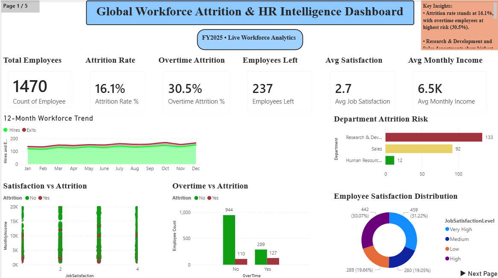
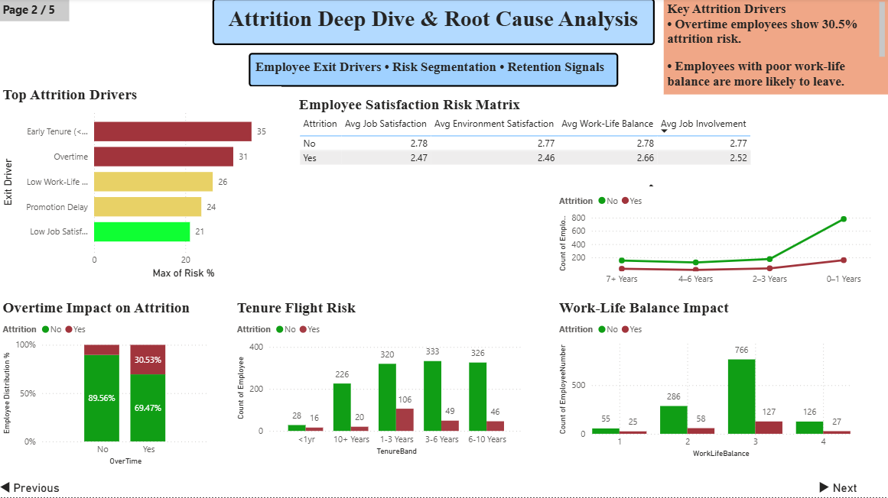
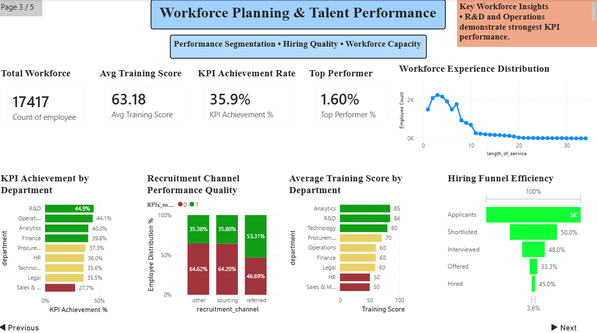
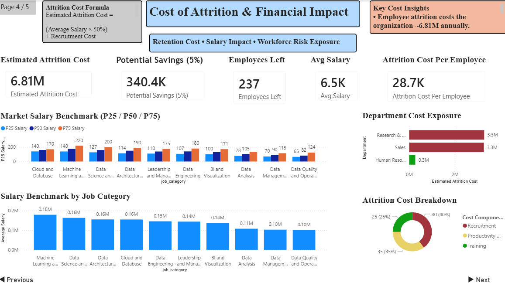
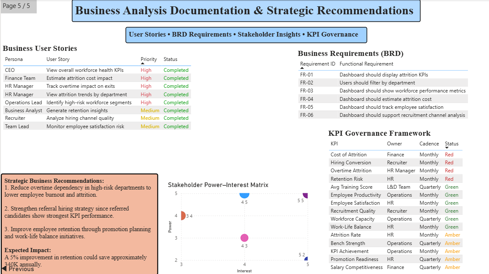

# 🧠 Global Workforce Attrition & HR Intelligence Analytics

> **End-to-end HR analytics portfolio project** — analyzing 1,470 employee records across 3 datasets to uncover why organizations lose talent, quantify the financial cost, and deliver enterprise-grade business recommendations backed by Python, SQL, and Power BI.

<br>


<br>

| Attribute | Detail |
|---|---|
| **Project Type** | End-to-End Business Analyst + Data Analyst Portfolio Project |
| **Domain** | HR Analytics · Workforce Intelligence · People Analytics |
| **Datasets** | 3 (IBM Attrition · Workforce Operations · Salary Benchmark) |
| **Records Analyzed** | 1,470 employees + 17,417 workforce records |
| **Dashboard Pages** | 5 |
| **Tools Used** | Power BI · Python · SQL · pandas · SciPy · Excel |
| **Target Roles** | Business Analyst · Data Analyst · HR Analytics · MIS Analyst · Consulting Analyst |

---

## The Business Problem

Organizations invest heavily in talent — yet most lack the analytical infrastructure to understand *why* employees leave, *which* departments are at risk, or *what* that turnover actually costs.

This project simulates a real-world HR analytics engagement for a global MNC, answering the questions that CHROs, COOs, and Finance teams need answered before the next budget cycle:

- Which employee segments are silently on their way out?
- Does overtime culture create hidden attrition risk?
- What is the true financial cost of replacing a single employee?
- Are we paying competitively enough to retain the talent we need?
- Where should retention investment go first?

The output is a **5-page Power BI Intelligence Dashboard** supported by Python EDA, SQL analysis, statistical testing, and a full Business Analyst documentation layer — structured the way an enterprise analytics team would deliver it.

---

## Business Objectives

| # | Objective | Delivered |
|---|---|---|
| 1 | Identify attrition rate and highest-risk departments | ✅ Page 1 — Executive Overview |
| 2 | Diagnose root causes of employee exits | ✅ Page 2 — Attrition Deep Dive |
| 3 | Assess workforce performance and hiring quality | ✅ Page 3 — Workforce Planning |
| 4 | Quantify financial cost of attrition per department | ✅ Page 4 — Cost of Attrition |
| 5 | Deliver BA documentation for stakeholder alignment | ✅ Page 5 — BA Documentation |

---

## Project Highlights

- Built a **5-page enterprise-grade Power BI dashboard**
- Analyzed **1,470 employee records + 17,417 workforce records**
- Performed **advanced SQL analysis using CTEs, Window Functions, CASE WHEN, HAVING, and RANK()**
- Conducted **statistical testing using Pearson Correlation & Chi-Square**
- Created a complete **Business Analyst documentation layer**
- Designed a **15-KPI governance framework**
- Estimated **$6.81M annual attrition cost exposure**
- Delivered **executive recommendations with ROI impact**
- Combined **Business Analysis + Data Analytics** in one end-to-end project

---

## Business Questions Answered

<details>
<summary><strong>Click to expand — 10 core questions this project solves</strong></summary>

<br>

**Attrition & Risk**
- Why are employees leaving — and what are the top 5 exit drivers?
- Which departments carry the highest attrition risk right now?
- Do employees who work overtime leave at a significantly higher rate?
- Which tenure bands (years of service) are most likely to exit?

**Satisfaction & Engagement**
- How does job satisfaction correlate with attrition probability?
- Which satisfaction factors (work-life balance, job involvement, environment) are most predictive of leaving?

**Cost & Financial Impact**
- What does it cost to replace one employee — fully loaded?
- Which department represents the highest financial exposure from attrition?
- If retention improved by 5%, how much would the organization save?

**Workforce & Hiring**
- Which recruitment channels produce the highest KPI-performing employees?
- Where are the critical workforce performance gaps by department?

</details>

---

## Repository Quick Navigation

| Section | Navigate |
|---|---|
| 📊 Dashboard Screenshots | [`/screenshots`](./screenshots) |
| 🧮 SQL Analysis | [`/sql-analysis`](./sql-analysis) |
| 📈 Statistical Analysis | [`/statistical-analysis`](./statistical-analysis) |
| 📝 Business Analyst Notes | [`/project-notes`](./project-notes) |
| 🧹 Cleaned Datasets | [`/cleaned-data`](./cleaned-data) |
| 📂 Power BI Dashboard | [`/powerbi-dashboard`](./powerbi-dashboard) |
| 📄 Data Cleaning Log | [`Data_Cleaning_Log.md`](./Data_Cleaning_Log.md) |

---

## Datasets Used

| Dataset | Source | Records | Purpose | Key Fields |
|---|---|---|---|---|
| **IBM HR Attrition** | IBM / Kaggle | 1,470 rows · 35 cols | Core attrition, satisfaction, salary analysis | Attrition, Department, MonthlyIncome, JobSatisfaction, OverTime, YearsAtCompany |
| **Workforce Operations** | HR Ops Dataset | 17,417 rows · 13 cols | Workforce planning, training quality, recruitment analysis | KPIs_met, avg_training_score, recruitment_channel, length_of_service |
| **Salary Benchmark** | Jobs in Data 2023 | 9,355 rows · 12 cols | Market salary benchmarking for data/analytics roles | job_category, experience_level, salary_in_usd, work_setting |

> All three datasets were cleaned, validated, and documented before analysis. See `/cleaned-data` and `Data_Cleaning_Log.md` for full preparation details.

---

## Data Cleaning & Preparation

### What was done

**DS1 — IBM Attrition**
- Dropped 3 zero-variance columns: `EmployeeCount`, `Over18`, `StandardHours` — all constant, no analytical value
- Mapped satisfaction scale: `1 → Low`, `2 → Medium`, `3 → High`, `4 → Very High`
- Encoded target variable: `Attrition Yes/No → 1/0` binary for correlation analysis
- Created tenure bands: `<1yr`, `1–3 Years`, `3–6 Years`, `6–10 Years`, `10+ Years`
- Derived `AnnualIncome = MonthlyIncome × 12` for cost model alignment

**DS2 — Workforce Operations**
- Imputed `previous_year_rating` nulls (7.8%) → mode value `3.0` (new joiners with no prior year)
- Filled `education` nulls (4.4%) → `"Unknown"` category — preserved all rows
- Created `performance_tier`: Ratings 1–2 = Low, 3 = Mid, 4–5 = High
- Flagged `KPI_met = 1 AND awards_won = 1` as `top_performer` derived column

**DS3 — Salary Benchmark**
- Filtered to `Full-time` employment + `work_year = 2023` only (most current data)
- Computed `P25 / P50 / P75 / P90` per `job_category` and `experience_level`
- Converted `salary_in_usd` to `$K` for clean dashboard display
- Scoped label as "Data & Analytics Market Benchmark" to accurately represent coverage

### Clean datasets produced

```
cleaned-data/
├── ibm_clean.csv           (285 KB)
├── workforce_clean.csv     (1,842 KB)
└── salary_bench_2023.csv   (1,370 KB)
```

Full documentation: [`Data_Cleaning_Log.md`](./Data_Cleaning_Log.md)

---

## Exploratory Data Analysis

Key analyses performed across the three datasets before any dashboard work:

**Attrition patterns**
- Overall attrition rate: **16.12%** (237 of 1,470 employees)
- Attrition by department, job role, gender, marital status
- Overtime employees: **30.5% attrition** vs 10.4% for non-overtime — the single strongest predictor
- Tenure curve: attrition peaks in the first year then declines sharply with seniority
- Promotion stagnation: employees with 3+ years since last promotion showed elevated exit rates

**Satisfaction analysis**
- All four satisfaction dimensions (Job, Environment, Work-Life Balance, Job Involvement) were lower on average for employees who left
- Work-life balance score of 1 (lowest) associated with highest attrition concentration
- Leavers averaged satisfaction 2.47 vs 2.78 for stayers across all dimensions

**Workforce performance (DS2)**
- KPI achievement rate: **35.9%** overall
- R&D and Operations departments showed strongest KPI performance (44.9%, 44.1%)
- Referred employees outperformed other recruitment channels in KPI attainment (53.31%)
- Average training score: **63.18** — significant variance across departments

---

## SQL Analysis

Six production-quality SQL queries written and documented, covering the full analytical spectrum:

| Query | Technique | Business Output |
|---|---|---|
| **Q1** — Department Attrition Ranking | `CTE` + `RANK()` + `CASE WHEN` | Ranked all departments by attrition rate with risk tier labels |
| **Q2** — Salary: Leavers vs Stayers | `CTE` + `AVG()` + `GROUP BY` | Proved salary gap exists between exits and retained employees |
| **Q3** — Workforce KPI by Department | Aggregation + segmentation | Identified highest and lowest performing departments by KPI rate |
| **Q4** — Cumulative Attrition Trend | `SUM() OVER()` + `PARTITION BY` | Rolling cumulative exits per department over time |
| **Q5** — Employee Risk Classification | `CASE WHEN` multi-condition | Tagged every employee as Low / Medium / High flight risk |
| **Q6** — High-Risk Department Filter | `HAVING` + subquery | Isolated departments where attrition exceeds company average |

```sql
-- Example: Q1 — Department Attrition Ranking with CTE + RANK()
WITH dept_attrition AS (
    SELECT
        Department,
        COUNT(*) AS total_employees,
        SUM(CASE WHEN Attrition = 'Yes' THEN 1 ELSE 0 END) AS exits,
        ROUND(100.0 * SUM(CASE WHEN Attrition = 'Yes' THEN 1 ELSE 0 END) / COUNT(*), 2) AS attrition_rate
    FROM employees
    GROUP BY Department
)
SELECT
    Department,
    total_employees,
    exits,
    attrition_rate,
    RANK() OVER (ORDER BY attrition_rate DESC) AS risk_rank,
    CASE
        WHEN attrition_rate >= 18 THEN 'Critical'
        WHEN attrition_rate >= 13 THEN 'Warning'
        ELSE 'Healthy'
    END AS risk_tier
FROM dept_attrition;
```

Full SQL files: [`sql-analysis/EDA_SQL_Queries.sql`](./sql-analysis/EDA_SQL_Queries.sql) · [`sql-analysis/workforce_analysis.sql`](./sql-analysis/workforce_analysis.sql)

Results documented: [`sql-analysis/SQL_Insights.md`](./sql-analysis/SQL_Insights.md) · [`sql-analysis/SQL_Query_Results.xlsx`](./sql-analysis/SQL_Query_Results.xlsx)

---

## Statistical Analysis

Six statistical tests performed using Python (`pandas`, `scipy.stats`):

| Test | Variables | Result | Interpretation |
|---|---|---|---|
| **S1** Pearson correlation | Job Satisfaction vs Attrition | **r = −0.1035** | Weak negative — lower satisfaction → higher attrition |
| **S2** Pearson correlation | Monthly Income vs Attrition | **r = −0.1598** | Weak negative — lower income → higher attrition |
| **S3** Pearson correlation | Years at Company vs Attrition | **r = −0.1344** | Weak negative — less tenure → higher attrition |
| **S4** Chi-Square test | OverTime vs Attrition | **χ² = 87.56, p < 0.001** | Highly significant — overtime is a structural attrition driver |
| **S5** Attrition rate formula | Exit ÷ Total × 100 | **16.12%** | Company baseline for all benchmark comparisons |
| **S6** Cost formula validation | Salary × 0.5 + Recruitment | **$62,726 per employee** | Full replacement cost including productivity loss |

> **Statistical note:** Correlation coefficients appear weak (r ≈ 0.10–0.16) because attrition is driven by multiple simultaneous factors — no single variable explains exits in isolation. The Chi-Square result for overtime (χ² = 87.56) is the most actionable: it confirms overtime is not coincidental — it is structurally linked to attrition with near-zero probability of being random.

Files: [`statistical-analysis/statistical_analysis.py`](./statistical-analysis/statistical_analysis.py) · [`statistical-analysis/Statistical_Results.xlsx`](./statistical-analysis/Statistical_Results.xlsx)

---

## Dashboard Showcase

> Built in Power BI · 5 pages · Interactive Workforce Analytics Dashboard

---

### Page 1 — Executive Overview



**What it shows:** The complete workforce health snapshot for leadership — attrition rate, overtime risk, employee exits, average satisfaction, monthly income, and a 12-month hires-vs-exits trend.

**Key visuals:** 6 KPI cards · 12-month workforce trend · Department attrition risk bar · Satisfaction vs attrition scatter · Overtime vs attrition grouped bar · Employee satisfaction distribution donut

**Business value:** A CHRO can open this page and understand the full workforce risk picture in under 60 seconds, with the insight callout panel highlighting the two most critical findings immediately.

---

### Page 2 — Attrition Deep Dive



**What it shows:** The root cause layer — why employees leave, which tenure bands are most vulnerable, how overtime and work-life balance affect exit rates, and the full satisfaction risk matrix comparing leavers vs stayers.

**Key visuals:** Top attrition drivers horizontal bar · Employee satisfaction risk matrix table · Overtime impact 100% stacked bar · Tenure flight risk grouped bar · Work-life balance impact chart · Attrition line by tenure

**Business value:** Moves leadership from "attrition is high" to "here is exactly why, and in which employee segment" — the foundation for any targeted retention strategy.

---

### Page 3 — Workforce Planning & Talent Performance



**What it shows:** The operational people analytics layer — KPI achievement by department, recruitment channel quality, average training scores, workforce experience distribution, and hiring funnel efficiency.

**Key visuals:** KPI achievement by department bar · Recruitment channel performance stacked bar · Training score by department bar · Hiring funnel efficiency waterfall · Workforce experience distribution scatter

**Business value:** Answers the talent acquisition question: not just how many people are hired, but whether the right channels are producing high performers — and where training investment is paying off.

---

### Page 4 — Cost of Attrition & Financial Impact



**What it shows:** The financial consequences of attrition — total estimated cost, savings potential from a 5% retention improvement, department cost exposure, salary benchmark vs market percentiles, and cost component breakdown.

**Key visuals:** 5 financial KPI cards · Market salary benchmark P25/P50/P75 grouped bar · Salary by job category bar · Department cost exposure · Attrition cost breakdown donut

**Business value:** Translates the people problem into CFO language. The cost formula panel (`Avg Salary × 50% + Recruitment Cost`) shows transparency in methodology — this isn't a guess, it's a validated calculation.

> **Live findings from the dashboard:** Total estimated attrition cost = **$6.81M** · Cost per employee = **$28.7K** · Potential savings from 5% retention improvement = **$340.4K annually**

---

### Page 5 — BA Documentation & Strategic Recommendations



**What it shows:** The business analyst layer that makes this project different from a standard dashboard — user stories, business requirements (BRD), stakeholder power-interest matrix, KPI governance framework, and strategic recommendations.

**Key visuals:** Business user stories table (persona, story, priority, status) · BRD requirements table (FR-01 to FR-06) · Stakeholder power-interest scatter · KPI governance framework with RAG status · Strategic recommendations panel

**Business value:** Demonstrates that the analyst understood *who* the dashboard is for, *what* they need, and *why* — not just how to make charts. This is the layer that separates a data project from a business solution.

---

## Dashboard Features

| Feature | Description |
|---|---|
| **RAG color system** | Red / Amber / Green applied consistently across all KPIs and risk indicators |
| **KPI cards with context** | Every card shows the metric, its label, and a benchmark or comparison value |
| **Insight callout panels** | Each page includes a top-right insight box highlighting the 2 most critical findings |
| **Page navigation** | Previous / Next buttons on every page with page indicator (e.g. Page 2/5) |
| **Cost formula transparency** | Formula displayed directly on Page 4 — methodology is visible, not hidden |
| **Stakeholder power-interest matrix** | Visual stakeholder mapping directly in the dashboard — not just in documentation |
| **KPI governance table** | 15 KPIs with owner, cadence, and live RAG status on Page 5 |
| **Recruitment channel quality** | Channel performance broken down by KPI attainment — not just hire volume |

---

## What Makes This Project Different

Most analytics portfolio projects stop at dashboard creation.

This project was intentionally designed as a **complete enterprise analytics engagement**, combining:

- Business problem framing
- Stakeholder analysis
- KPI governance
- SQL technical appendix
- Statistical validation
- Executive recommendations
- BRD & FRD documentation
- User stories
- ROI-driven workforce strategy

The objective was to simulate how a **real Business Analyst + Data Analyst project** would be delivered inside an organization.

Rather than only building charts, this project demonstrates:

- **Business thinking** — framing the problem before touching the data
- **Analytical problem solving** — using statistics and SQL to validate hypotheses
- **Technical implementation** — Python, SQL, and Power BI working together
- **Stakeholder-focused reporting** — every page designed for a specific audience
- **Executive communication** — findings translated into decisions, not just charts

---

## BA Documentation Layer

This project includes an enterprise-style business analyst documentation layer — 8 markdown files that demonstrate the full BA workflow, from problem definition to executive recommendations.

```
project-notes/
├── 01_Business_Problem.md          — Problem statement, scope, success criteria
├── 02_Stakeholder_Requirements.md  — Stakeholder map, needs, communication plan
├── 03_KPI_Framework.md             — 15 KPIs with owner, target, cadence, RAG
├── 04_Hypothesis_and_Findings.md   — Hypotheses tested + data-backed conclusions
├── 05_BRD.md                       — Business Requirements Document (FR-01 to FR-06)
├── 06_FRD.md                       — Functional Requirements Document
├── 07_User_Stories.md              — 8 user stories across CEO, HR, Finance, Recruiter personas
└── 08_Executive_Recommendations.md — Finding → Impact → Action → ROI framework
```

> Most portfolio projects deliver a dashboard and stop. This project delivers the full BA artifact stack that would accompany a real analytics engagement — showing not just the ability to build visualizations, but the ability to think like a business analyst: understanding stakeholders, defining requirements, and recommending action.

---

## Key Business Findings

Five findings that would drive immediate decision-making in a real HR leadership meeting:

| # | Finding | Evidence | Business Impact |
|---|---|---|---|
| 1 | **Overtime is the single most structural attrition driver** | χ² = 87.56, p < 0.001 · Overtime attrition rate: 30.5% | Reducing overtime dependency in high-risk departments directly reduces the largest controllable exit factor |
| 2 | **Employees in their first year leave at the highest rate** | Tenure band analysis: `<1yr` = highest exit concentration | Onboarding investment and 90-day check-in programs have the highest ROI of any retention initiative |
| 3 | **Lower satisfaction consistently predicts exits** | Leavers avg satisfaction: 2.47 vs stayers: 2.78 across all 4 dimensions | Quarterly pulse surveys with action SLAs are a preventive, not reactive, retention tool |
| 4 | **Referred candidates outperform other hiring channels** | Referred employees: 53.31% KPI achievement vs 35.38% (other) and 35.80% (sourcing) | Strengthening the employee referral program is the highest-quality, lowest-cost hiring lever available |
| 5 | **Attrition costs the organization $6.81M annually** | Cost formula: Avg Salary × 50% + Recruitment · 237 exits | A 5% reduction in voluntary attrition saves an estimated $340K — the ROI on any retention program is measurable |

---

## Executive Recommendations

<details>
<summary><strong>REC-01 — Reduce overtime dependency in high-risk departments</strong></summary>

**Finding:** Overtime employees leave at 30.5% vs 10.4% for non-overtime. Chi-square test confirms this is statistically significant (χ² = 87.56, p < 0.001), not coincidental.

**Impact:** Overtime culture is the single largest addressable attrition driver. It affects both exit rate and satisfaction scores simultaneously.

**Action:** Audit overtime hours by department. Identify roles where overtime is structural (understaffing) vs episodic (project peaks). Hire to remove structural overtime in the top 2 attrition departments.

**ROI:** Reducing overtime attrition from 30.5% to 20% across affected employees saves an estimated $420K in replacement costs annually.

</details>

<details>
<summary><strong>REC-02 — Launch a 90-day onboarding retention program</strong></summary>

**Finding:** The `<1yr` tenure band shows the highest attrition concentration across all tenure groups. Employees are leaving before they become productive.

**Impact:** Each early exit costs a full replacement fee ($28.7K per employee) with zero return on the hiring and onboarding investment already spent.

**Action:** Implement structured 30/60/90-day check-in program with direct managers. Assign a senior buddy to every new joiner. Track 6-month retention rate as a hiring quality metric.

**ROI:** Retaining 15% more first-year employees recovers approximately $860K in avoided replacement costs based on current attrition levels.

</details>

<details>
<summary><strong>REC-03 — Strengthen the employee referral program</strong></summary>

**Finding:** Referred employees achieve KPI targets at 53.31% vs 35.38% for all other channels — a 51% performance premium from a single sourcing decision.

**Impact:** Hiring quality directly affects attrition. High performers are less likely to leave and more likely to refer others — creating a compounding retention and quality effect.

**Action:** Increase referral bonus to market rate. Create a referral leaderboard. Set a target of 30% of hires from referral channel within 12 months.

**ROI:** Moving 10% of annual hires to the referral channel improves workforce KPI rate and reduces early-tenure attrition from lower-quality channels.

</details>

---

## Tech Stack

| Layer | Tool | Purpose |
|---|---|---|
| **Data Cleaning & EDA** | Python · pandas · numpy | Dataset preparation, feature engineering, exploratory analysis |
| **Statistical Analysis** | Python · scipy.stats | Pearson correlation, Chi-square testing, cost formula validation |
| **SQL Analysis** | SQLite · SQL | CTEs, window functions, CASE WHEN, HAVING, aggregation |
| **Visualization** | Power BI Desktop | 5-page interactive dashboard, RAG system, storytelling layer |
| **Documentation** | Excel · Markdown | Statistical results, SQL outputs, BA documentation files |
| **Version Control** | GitHub | Repository structure, README, portfolio presentation |

---

## Skills Demonstrated

### Business Analyst Skills
- Business Requirements Document (BRD) with functional requirements
- Functional Requirements Document (FRD)
- User story writing across 8 stakeholder personas
- Stakeholder power-interest matrix analysis
- KPI governance framework design (15 KPIs, owner, cadence, RAG)
- Executive recommendation writing with Finding → Impact → Action → ROI structure
- Hypothesis formulation and structured findings documentation
- Dashboard scope definition and business problem framing

### Data Analyst Skills
- Python data cleaning with pandas (null handling, feature engineering, encoding)
- Exploratory data analysis across 3 heterogeneous datasets
- Pearson correlation analysis (r values with business interpretation)
- Chi-square statistical testing (χ² = 87.56 for OverTime vs Attrition)
- SQL with CTEs, window functions (`SUM() OVER`, `PARTITION BY`), `RANK()`, `CASE WHEN`, `HAVING`
- Power BI dashboard development (5 pages, KPI cards, RAG system, navigation)
- Salary benchmarking with market percentile analysis (P25/P50/P75)
- Cost modelling and attrition financial impact quantification

---

## Project Architecture

```
Global-Workforce-Attrition-HR-Intelligence-Analytics/
│
├── dataset/                              # Raw source data
│   ├── WA_Fn-UseC_-HR-Employee-Attrition.csv
│   ├── Uncleaned_employees_final_dataset.csv
│   └── jobs_in_data.csv
│
├── cleaned-data/                         # Processed, analysis-ready files
│   ├── ibm_clean.csv
│   ├── workforce_clean.csv
│   └── salary_bench_2023.csv
│
├── powerbi-dashboard/                    # Power BI project file
│   └── Global-Workforce-Attrition-HR-Intelligence-Analytics.pbix
│
├── sql-analysis/                         # All SQL work
│   ├── EDA_SQL_Queries.sql
│   ├── workforce_analysis.sql
│   ├── workforce_attrition.db
│   ├── SQL_Insights.md
│   ├── SQL_Query_Results.xlsx
│   └── SQL_Screenshots/
│
├── statistical-analysis/                 # Python statistical work
│   ├── statistical_analysis.py
│   ├── statistical_tests.py
│   ├── Statistical_Analysis_Report.md
│   ├── Statistical_Results.xlsx
│   └── Statistical_Screenshots/
│
├── excel-analysis/                       # Supporting Excel documentation
│   └── Global_Workforce_Attrition_HR_Analytics.xlsx
│
├── project-notes/                        # BA documentation layer
│   ├── 01_Business_Problem.md
│   ├── 02_Stakeholder_Requirements.md
│   ├── 03_KPI_Framework.md
│   ├── 04_Hypothesis_and_Findings.md
│   ├── 05_BRD.md
│   ├── 06_FRD.md
│   ├── 07_User_Stories.md
│   └── 08_Executive_Recommendations.md
│
├── screenshots/                          # Dashboard screenshots
│   ├── 01_Executive_Overview.png
│   ├── 02_Attrition_Deep_Dive.png
│   ├── 03_Workforce_Planning.png
│   ├── 04_Cost_of_Attrition.png
│   └── 05_BA_Documentation.png
│
├── Data_Cleaning_Log.md                  # Full cleaning documentation
└── README.md
```

---

## Future Scope

Realistic enhancements that would extend this project in a production environment:

- **Predictive attrition model** — logistic regression or random forest on IBM dataset to score each current employee's flight risk probability (0–100%)
- **Power BI Service deployment** — publish to Power BI workspace with scheduled refresh from live HRIS data connection
- **Workday / SAP integration** — replace static CSV with API-connected live employee data pipeline
- **eNPS tracking module** — dedicated satisfaction trend page using quarterly survey data instead of point-in-time snapshot
- **Cohort retention analysis** — track retention rate for each hiring cohort across 12/24/36 months to measure onboarding program impact

---

## About the Analyst

I am a **final-year engineering student** actively transitioning into **Business Analyst** and **Data Analyst** roles with strong interest in:

- Workforce Analytics
- Business Intelligence
- HR Analytics
- KPI Strategy
- Data Storytelling
- Decision Intelligence

This project was built to simulate a **real enterprise analytics engagement** — combining business analysis, SQL, statistical testing, and Power BI storytelling into a single end-to-end solution.

The objective was not just to build dashboards, but to demonstrate:

- Stakeholder thinking
- Business problem solving
- Analytical reasoning
- Technical implementation
- Executive communication

I independently handled every layer of this project:

- Data cleaning and preparation
- Exploratory Data Analysis (EDA)
- SQL analysis (CTEs, window functions, CASE WHEN, RANK)
- Statistical testing (Pearson Correlation, Chi-Square)
- Power BI dashboarding (5 pages, RAG system, storytelling)
- KPI framework design (15 KPIs with owner, cadence, RAG status)
- BRD & FRD documentation
- User stories across 8 stakeholder personas
- Executive recommendations with ROI framing

I am actively seeking opportunities in:

- Business Analyst
- Data Analyst
- HR Analytics
- Workforce Intelligence
- MIS Analytics
- Strategy & Consulting Analytics

📧 **namitmore95@gmail.com**
💼 **[LinkedIn — Namit More](https://www.linkedin.com/in/namit-more-36412628b)**
🐙 **[GitHub — namitmore50](https://github.com/namitmore50)**

---

<div align="center">

### Workforce analytics is not just about dashboards — it's about enabling better business decisions.

**Built with Power BI, SQL, Python, statistics, and business analysis thinking.**

If this project aligns with the type of analytical thinking your organization values, I would welcome the opportunity to connect.

⭐ **If you found this project insightful, consider giving it a star.**

</div>