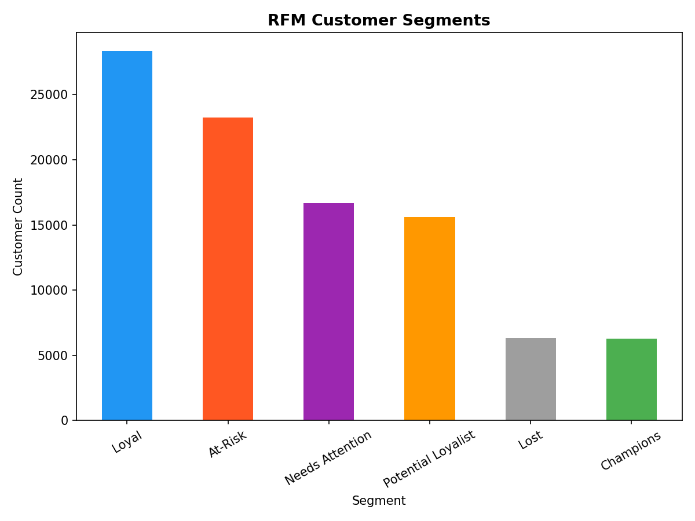
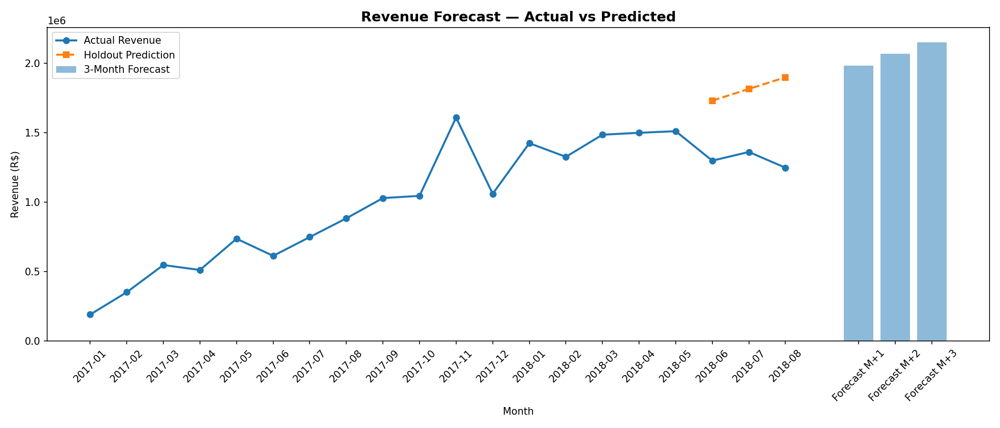
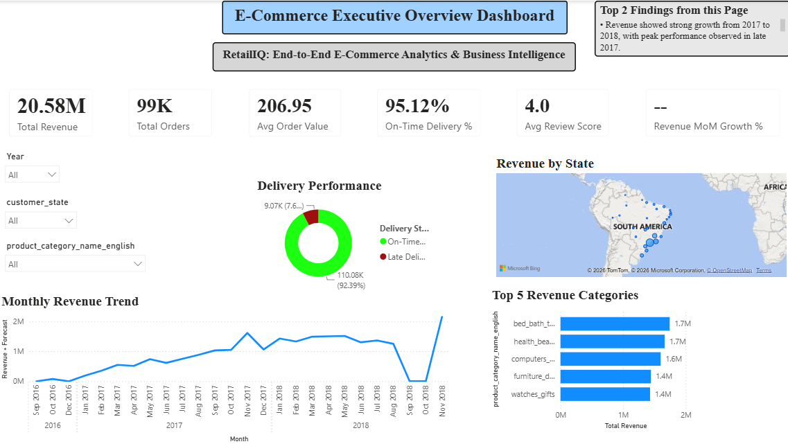
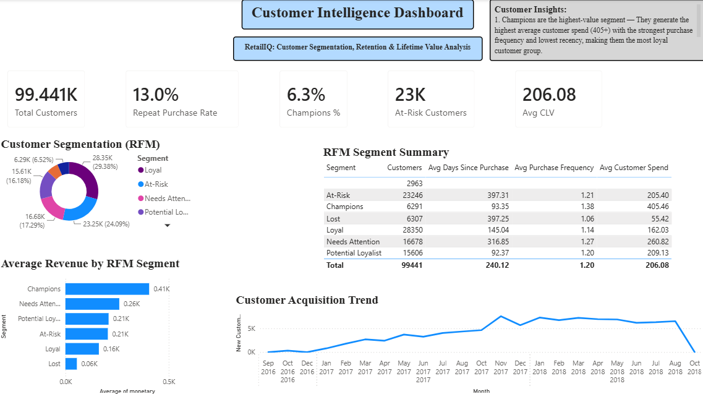
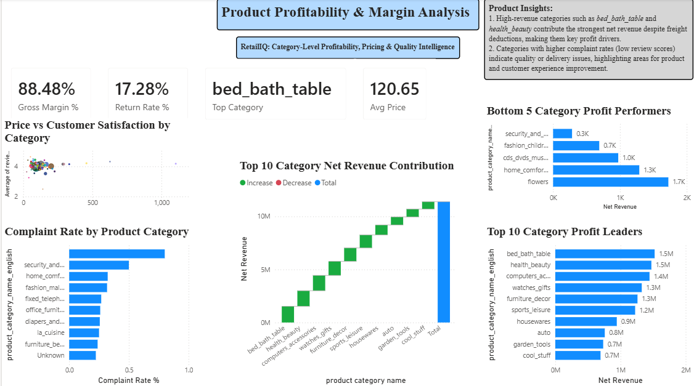
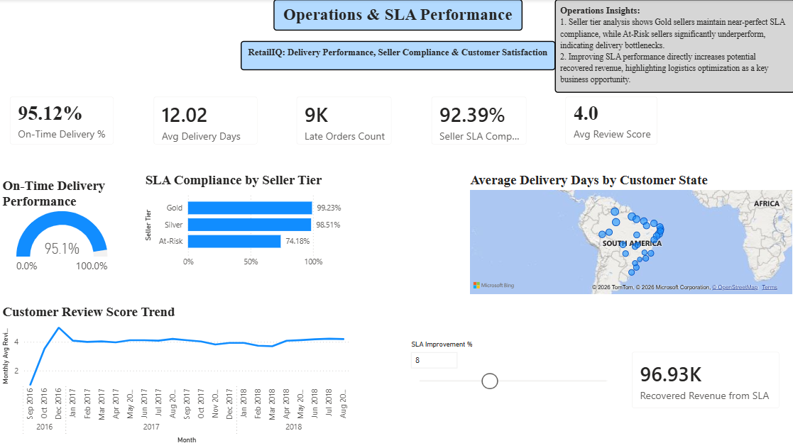
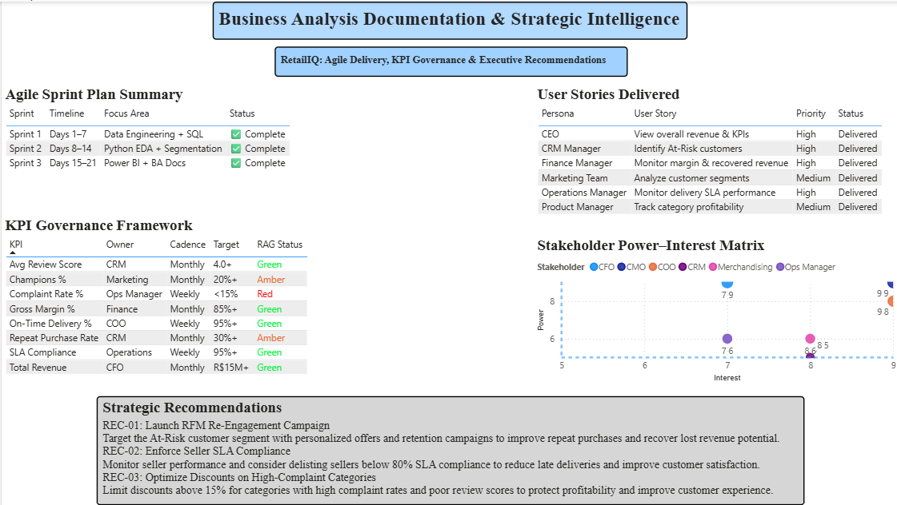
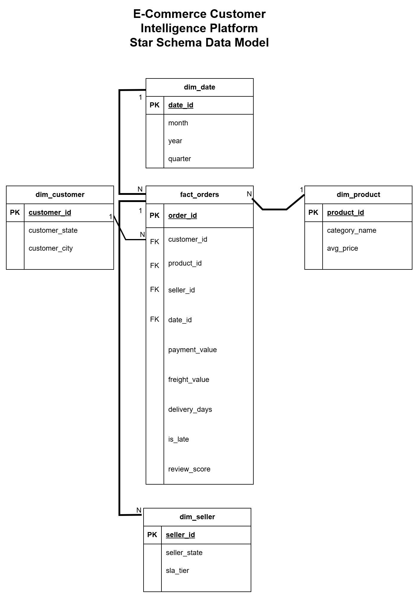
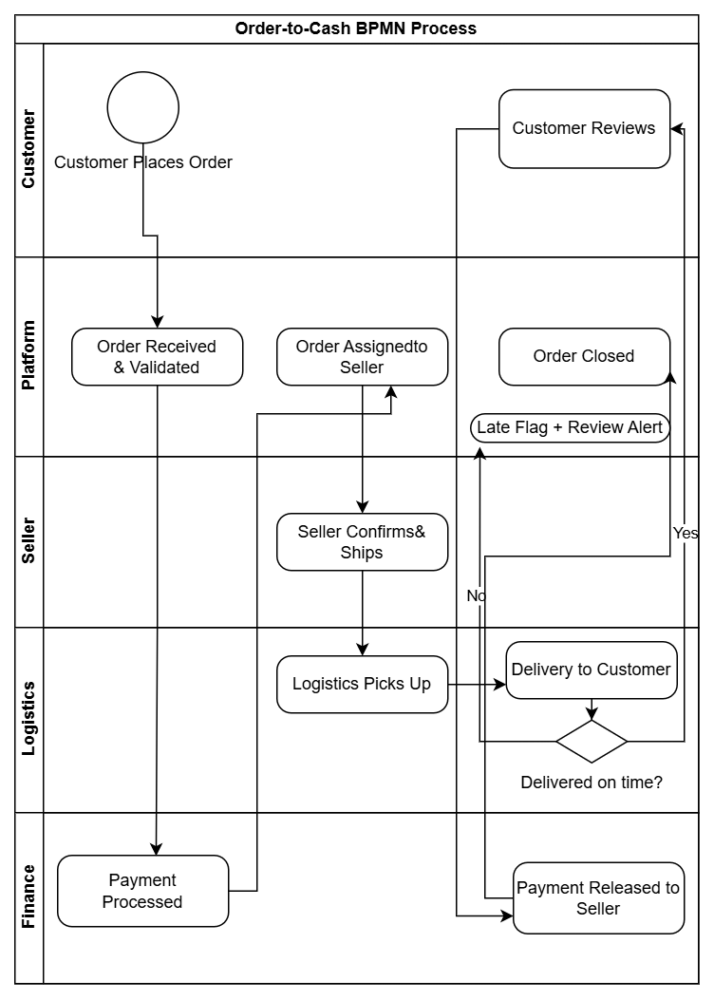

<div align="center">

# 🛒 E-Commerce Customer Intelligence Platform
### *RetailIQ — End-to-End Business Analytics & Intelligence Engagement*

**Transforming 119,143 raw e-commerce transactions into executive-grade customer intelligence, revenue forecasting, and strategic business recommendations — delivered as a 7-sprint Agile engagement.**

---


---

| 📊 Dataset | 🛠️ Tools | 📁 Deliverables | 🏃 Methodology |
|:-----------:|:----------:|:----------------:|:---------------:|
| Brazilian E-Commerce (Olist) | Python · SQL · Power BI · Excel | 35+ files across 10 folders | 7-Sprint Agile Delivery |
| **119,143 rows · 8 tables** | **Pandas · SciPy · Scikit-Learn** | **5 Dashboard Pages · 13 BA Docs** | **Scrum-Inspired Framework** |

</div>

---

## 🚀 Enterprise-Level Deliverables

<div align="center">

✅ &nbsp;**20 SQL Business Queries** &nbsp;&nbsp;|&nbsp;&nbsp; ✅ &nbsp;**5 Power BI Dashboard Pages** &nbsp;&nbsp;|&nbsp;&nbsp; ✅ &nbsp;**13 BA Documents**
✅ &nbsp;**15-KPI Governance Framework** &nbsp;&nbsp;|&nbsp;&nbsp; ✅ &nbsp;**15 UAT Scenarios** &nbsp;&nbsp;|&nbsp;&nbsp; ✅ &nbsp;**End-to-End 7-Sprint Agile Delivery**

</div>

---

## ⚡ Quick Access

| Section | Link | What's Inside |
|---------|------|--------------|
| 📊 Power BI Dashboard | [`/screenshots/`](screenshots/) | 5-page executive dashboard previews |
| 📘 BA Documentation | [`/project-notes/`](project-notes/) | 13 enterprise BA documents |
| 🧠 SQL Analysis | [`/sql-analysis/`](sql-analysis/) | 20 queries · insights · results workbook |
| 🐍 Python Analytics | [`/python-analysis/`](python-analysis/) | EDA · RFM · Forecasting · A/B testing |
| 🏗️ Business Architecture | [`/process-diagrams/`](process-diagrams/) | Star schema · BPMN · EDA charts |

---

## 📋 Table of Contents

1. [Executive Overview](#-executive-overview)
2. [Business Problem Statement](#-business-problem-statement)
3. [Business Impact — Quantified](#-business-impact--quantified)
4. [End-to-End Architecture](#-end-to-end-architecture)
5. [Project Folder Structure](#-project-folder-structure)
6. [Tech Stack](#-tech-stack)
7. [Sprint Methodology](#-sprint-methodology)
8. [SQL Business Analysis](#-sql-business-analysis--20-queries)
9. [Python Analytics](#-python-analytics-pipeline)
10. [Power BI Dashboard](#-power-bi-dashboard--5-pages)
11. [Key Business Insights](#-key-business-insights)
12. [Business Analysis Documentation](#-business-analysis-documentation)
13. [BPMN & Star Schema](#-business-architecture)
14. [UAT & KPI Governance](#-uat--kpi-governance)
15. [Resume-Ready Summary](#-resume-ready-project-summary)
16. [About](#-about)

---

## 🎯 Executive Overview

> *"This project simulates a full end-to-end enterprise analytics engagement — the kind a BA/DA team would deliver to a retail client across multiple sprints, from raw data to executive recommendations."*

**RetailIQ** is a flagship Business Intelligence and Business Analysis project built on the **Brazilian E-Commerce Public Dataset (Olist)** — comprising **119,143 transactions**, **8 relational tables**, and data spanning the full order-to-cash lifecycle.

The engagement was structured as a **7-sprint Agile delivery**, replicating how analytics teams operate inside MNCs: starting with data engineering, moving through analytical layers (SQL → Python → Power BI), and closing with enterprise-grade BA documentation, KPI governance, and board-ready executive recommendations.

### Why This Project Exists

Most portfolio projects demonstrate tool usage. This project demonstrates **how a Business Analyst and Data Analyst think** — from stakeholder requirements and KPI planning, through statistical validation and forecasting, to actionable business strategy with quantified ROI.

### What Was Delivered

| Layer | Deliverable | Output |
|-------|-------------|--------|
| **Data Engineering** | Cleaned 8-table dataset | `master_orders.csv` — 119,143 rows |
| **SQL Analytics** | 20 business queries | Revenue · Customer · Operations · Seller intelligence |
| **Excel Analysis** | KPI workbook + business case | Financial model + A/B test design |
| **Python Analytics** | 5 Jupyter Notebooks | EDA · RFM · Forecasting · A/B Testing · Statistical Analysis |
| **Power BI** | 5-page executive dashboard | Customer Intelligence Platform |
| **BA Documentation** | 13 markdown documents | BRD · FRD · UAT · RTM · BPMN · Risk Register |
| **Architecture** | Star Schema + BPMN | Dimensional model + Order-to-Cash workflow |

---

## 🔍 Business Problem Statement

A rapidly growing D2C e-commerce company is experiencing three compounding challenges that are eroding its competitive position:

**Challenge 1 — Customer Attrition Blind Spot**
The CRM team has no visibility into *which* customers are actively disengaging from the platform before they churn completely. Without proactive identification and intervention, high-value customers quietly lapse — and their revenue is lost.

**Challenge 2 — Operations Performance Gap**
Delivery SLA compliance sits at **92.2%** — below the industry benchmark of **95%**. The operations team lacks granular visibility into *which sellers*, *which geographies*, and *which delivery windows* are driving the shortfall. Without this, targeted corrective action is impossible.

**Challenge 3 — Revenue Planning Without Data**
The CFO's team makes quarterly planning decisions without a forward-looking revenue model. Month-on-month performance is tracked retrospectively, but no forecasting capability exists to guide inventory, staffing, or marketing spend allocation.

**The CMO has commissioned a 7-sprint analytics engagement to build a Customer Intelligence Platform that answers:**

1. Who are our most valuable and most at-risk customers?
2. Which product categories are actually profitable after freight costs?
3. Where is our delivery SLA breaking down — and what does fixing it recover?
4. What does revenue look like over the next 3 months?
5. Does a discount-based re-engagement campaign generate positive ROI?

---

## 💰 Business Impact — Quantified

<div align="center">

| Metric | Value | Business Significance |
|--------|-------|-----------------------|
| 🚨 **At-Risk Revenue Identified** | **R$4.77 Million** | Recoverable revenue from 23,246 at-risk customers |
| 📊 **At-Risk Customers Flagged** | **23,246 customers (24.1%)** | Prioritised for re-engagement campaign |
| 🏆 **Champion Customers Identified** | **6,291 customers (6.5%)** | Priority loyalty programme candidates |
| 🎯 **A/B Test Revenue Uplift** | **R$344,813.88** | Validated discount campaign impact |
| 💹 **Campaign ROI Proven** | **73%** | Treatment vs Control — p = 0.0331 (statistically significant) |
| 🚚 **SLA Performance Gap** | **92.2% vs 95% benchmark** | 2.8pp gap × order volume = recovery opportunity |
| 📈 **3-Month Revenue Forecast** | **R$1.98M → R$2.07M → R$2.15M** | Upward revenue trajectory confirmed |
| 🗺️ **Top Revenue State** | **São Paulo — ~37.5% of revenue** | Priority geography for logistics and marketing investment |
| 🔬 **Statistical Finding** | **Pearson r = -0.3027, p < 0.05** | Longer delivery → significantly lower satisfaction (validated) |
| 💳 **Payment Dominance** | **Credit Card — 73.7% of transactions** | Checkout optimisation priority confirmed |

</div>

---

## 🏗️ End-to-End Architecture

```
┌─────────────────────────────────────────────────────────────────────┐
│                    RAW DATA LAYER                                    │
│  8 Olist CSV Tables · 119,143 rows · 9 columns avg per table        │
│  orders | customers | items | products | sellers | payments |        │
│  reviews | geolocation | category_translation                        │
└────────────────────────────┬────────────────────────────────────────┘
                             │
                             ▼ Sprint 1: Data Engineering
┌─────────────────────────────────────────────────────────────────────┐
│                    PYTHON DATA PIPELINE                              │
│  01_data_cleaning.ipynb                                              │
│  ├── Date parsing (5 datetime columns)                               │
│  ├── Feature engineering (delivery_days · is_late · order_month)    │
│  ├── Category translation (Portuguese → English)                     │
│  ├── 8-table join → master_orders.csv (119,143 × 22)                │
│  └── Data quality validation (0 nulls in critical fields)           │
└────────┬─────────────────────────────────┬──────────────────────────┘
         │                                 │
         ▼ Sprint 2                        ▼ Sprints 3–4
┌──────────────────┐             ┌────────────────────────────────────┐
│   SQL ANALYTICS  │             │      PYTHON ANALYTICS              │
│  20 queries      │             │  02_eda_analysis.ipynb             │
│  SQLite DB       │             │  ├── Revenue trend analysis        │
│  ├── Revenue     │             │  ├── Correlation matrix heatmap    │
│  ├── Customer    │             │  ├── Pearson r = -0.3027 (p<0.05) │
│  ├── Seller      │             │  03_rfm_segmentation.ipynb         │
│  ├── Operations  │             │  ├── 6 customer segments           │
│  └── Payments    │             │  ├── 23,246 at-risk customers      │
└──────────────────┘             │  04_forecasting.ipynb              │
                                 │  ├── Linear regression model       │
                                 │  ├── MAPE: 39.6%                   │
                                 │  └── 3-month: R$1.98M–R$2.15M     │
                                 │  05_ab_test_design.ipynb           │
                                 │  ├── p-value: 0.0331               │
                                 │  └── ROI: 73%                      │
                                 └───────────────┬────────────────────┘
                                                 │
                                                 ▼ Sprint 5: Architecture
                              ┌──────────────────────────────────────┐
                              │   BUSINESS ARCHITECTURE               │
                              │   Star Schema (1 Fact · 4 Dims)      │
                              │   BPMN Order-to-Cash Workflow         │
                              │   10-step swim lane process map       │
                              └───────────────┬──────────────────────┘
                                              │
                                              ▼ Sprint 6: Power BI
                              ┌──────────────────────────────────────┐
                              │   POWER BI EXECUTIVE DASHBOARD        │
                              │   Page 1 — Executive Overview         │
                              │   Page 2 — Customer Intelligence      │
                              │   Page 3 — Product Profitability      │
                              │   Page 4 — Operations & SLA           │
                              │   Page 5 — BA Documentation           │
                              └───────────────┬──────────────────────┘
                                              │
                                              ▼ Sprint 7: BA Docs
                              ┌──────────────────────────────────────┐
                              │   BA DOCUMENTATION SUITE (13 files)   │
                              │   BRD · FRD · UAT · RTM               │
                              │   User Stories · Acceptance Criteria   │
                              │   Agile Sprint Plan · Risk Register    │
                              │   Executive Recommendations            │
                              └──────────────────────────────────────┘
```

---

## 📁 Project Folder Structure

```
E-Commerce-Customer-Intelligence-Platform/
│
├── 📄 README.md                              ← You are here
├── 📄 Data_Cleaning_Log.md                   ← Full cleaning decision log
│
├── 📂 dataset/                               ← 9 raw Olist CSV files (never modified)
│   ├── olist_orders_dataset.csv             ← order lifecycle data
│   ├── olist_customers_dataset.csv          ← customer location data
│   ├── olist_order_items_dataset.csv        ← product and price per order
│   ├── olist_products_dataset.csv           ← product catalogue
│   ├── olist_sellers_dataset.csv            ← seller profiles
│   ├── olist_order_payments_dataset.csv     ← payment method and value
│   ├── olist_order_reviews_dataset.csv      ← customer review scores
│   ├── olist_geolocation_dataset.csv        ← ZIP-to-state mapping
│   └── product_category_name_translation.csv ← Portuguese → English mapping
│
├── 📂 cleaned-data/                          ← Python pipeline outputs
│   ├── master_orders.csv                    ← master analytical dataset (119,143 × 22)
│   ├── orders_clean.csv                     ← cleaned orders table
│   ├── products_clean.csv                   ← products with English categories
│   ├── rfm_segments.csv                     ← RFM scores and segments for 96K customers
│   └── forecast_output.csv                  ← 3-month forward revenue forecast
│
├── 📂 python-analysis/                       ← 5 Jupyter Notebooks
│   ├── 01_data_cleaning.ipynb               ← data engineering pipeline
│   ├── 02_eda_analysis.ipynb                ← EDA + Pearson correlation analysis
│   ├── 03_rfm_segmentation.ipynb            ← 6-segment RFM customer classification
│   ├── 04_forecasting.ipynb                 ← linear regression revenue forecast
│   └── 05_ab_test_design.ipynb              ← A/B test design · p=0.0331 · ROI=73%
│
├── 📂 sql-analysis/                          ← Full SQL analytics suite
│   ├── 01_business_queries.sql              ← all 20 business queries
│   ├── ecommerce_analysis.db                ← SQLite database
│   ├── SQL_Insights.md                      ← business findings per query
│   ├── SQL_Query_Results.xlsx               ← all 20 query outputs
│   └── SQL_Screenshots/                     ← 20 query result screenshots
│
├── 📂 powerbi-dashboard/
│   └── Ecommerce_Customer_Intelligence_Platf.pbix  ← 5-page Power BI dashboard
│
├── 📂 excel-analysis/
│   └── Ecommerce_Analytics_Workbook.xlsx    ← KPI framework · business case · A/B design
│
├── 📂 process-diagrams/                      ← 7 architecture visuals
│   ├── correlation_heatmap.png
│   ├── data_model_star_schema.png
│   ├── monthly_revenue_trend.png
│   ├── order_to_cash_bpmn.png
│   ├── revenue_forecast.png
│   ├── rfm_segments.png
│   └── top_categories.png
│
├── 📂 project-notes/                         ← 13 BA documentation files
│   ├── 01_Business_Problem.md
│   ├── 02_Stakeholder_Requirements.md
│   ├── 03_KPI_Framework.md
│   ├── 04_BRD.md
│   ├── 05_FRD.md
│   ├── 06_User_Stories.md
│   ├── 07_Acceptance_Criteria.md
│   ├── 08_UAT_Scenarios.md
│   ├── 09_RTM.md
│   ├── 10_Agile_Sprint_Plan.md
│   ├── 11_BPMN_Process_Flow.md
│   ├── 12_Risk_Register.md
│   └── 13_Executive_Recommendations.md
│
└── 📂 screenshots/                           ← 5 dashboard screenshots
    ├── 01_Executive_Overview.png
    ├── 02_Customer_Intelligence.png
    ├── 03_Product_Profitability.png
    ├── 04_Operations_SLA.png
    └── 05_BA_Documentation.png
```

---

## 🛠️ Tech Stack

| Layer | Tool / Library | Purpose |
|-------|---------------|---------|
| **Data Engineering** | Python · Pandas · NumPy | Cleaning · Feature engineering · 8-table merging |
| **Statistical Analysis** | SciPy · Pearson Correlation | Hypothesis validation · Significance testing |
| **Machine Learning** | Scikit-Learn (LinearRegression) | 3-month revenue forecasting |
| **Customer Analytics** | Pandas · Custom RFM logic | 6-segment customer classification |
| **Experimentation** | SciPy · Chi-Square | A/B test design and statistical validation |
| **SQL Analytics** | SQLite · DB Browser | 20 business queries across joined tables |
| **Data Visualisation** | Matplotlib · Seaborn | EDA charts · Correlation heatmap · Forecast plots |
| **BI Dashboard** | Power BI Desktop · DAX | 5-page executive dashboard · KPI cards · What-if |
| **Business Case** | Microsoft Excel | Financial modelling · ROI calculation · SLA analysis |
| **BA Documentation** | Markdown · draw.io | 13 enterprise BA documents · BPMN diagram |
| **IDE** | VS Code · Jupyter Notebook | Python development and notebook execution |
| **Version Control** | GitHub | Portfolio hosting and version management |

---

## 🏃 Sprint Methodology

This project was delivered using a **Scrum-inspired 7-sprint Agile framework**, with each sprint producing defined, testable business deliverables. Full sprint documentation is available in [`project-notes/10_Agile_Sprint_Plan.md`](project-notes/10_Agile_Sprint_Plan.md).

```
Sprint 1 ─── Data Engineering & Cleaning          ✅ Completed
  └─ 9 CSVs → master_orders.csv (119,143 × 22)
  └─ Feature engineering: delivery_days, is_late, order_month

Sprint 2 ─── SQL Business Analysis                ✅ Completed
  └─ 20 queries: Revenue · Customer · Seller · Operations · Payments

Sprint 3 ─── Excel Business Analysis              ✅ Completed
  └─ KPI Framework · Financial Business Case · A/B Test Planning

Sprint 4 ─── Python Analytics                     ✅ Completed
  └─ EDA · RFM (6 segments) · Forecasting · A/B Testing · Statistics

Sprint 5 ─── Business Architecture                ✅ Completed
  └─ Star Schema (1 Fact, 4 Dims) · BPMN Order-to-Cash Workflow

Sprint 6 ─── Power BI Dashboard                   ✅ Completed
  └─ 5-page executive dashboard · DAX measures · What-if simulation

Sprint 7 ─── BA Documentation & Governance        ✅ Completed
  └─ 13 BA documents: BRD · FRD · RTM · UAT · Risk Register · BPMN
```

**Definition of Done (per sprint):**
All deliverable files created · All outputs validated against business requirements · Screenshots documented · Insights recorded in SQL_Insights.md or notebook markdown cells

---

## 🗄️ SQL Business Analysis — 20 Queries

All 20 queries are written in SQL (SQLite) and documented in [`sql-analysis/01_business_queries.sql`](sql-analysis/01_business_queries.sql) with results in [`sql-analysis/SQL_Query_Results.xlsx`](sql-analysis/SQL_Query_Results.xlsx).

### Query Inventory

| # | Query Name | SQL Technique | Business Output |
|---|-----------|---------------|-----------------|
| Q01 | Business KPI Overview | Aggregation + multiple metrics | Executive KPI snapshot |
| Q02 | Monthly Revenue Trend | `GROUP BY` + date formatting | 12-month revenue trajectory |
| Q03 | Revenue by Product Category | `GROUP BY` + `ORDER BY` | Top/bottom category revenue |
| Q04 | Revenue by Customer State | `GROUP BY` + geographic filter | SP confirmed at 37.5% share |
| Q05 | Top Customers by Revenue | `SUM` + `ORDER BY` + `LIMIT` | VIP customer identification |
| Q06 | Customer Satisfaction Analysis | `AVG` + segment filter | Satisfaction by customer tier |
| Q07 | Late Delivery Analysis | `CASE WHEN` + flag aggregation | 7.8% late delivery rate |
| Q08 | Customer Satisfaction Correlation | `AVG` + `GROUP BY` review band | Review score distribution |
| Q09 | Payment Method Analysis | `GROUP BY` payment type | Credit card at 73.7% |
| Q10 | Order Status Analysis | `COUNT` + `CASE WHEN` | 97% successful delivery rate |
| Q11 | Delivery Time Analysis | `AVG(delivery_days)` | 12-day avg confirmed |
| Q12 | Revenue vs Review Score | `AVG` + revenue cohort | High-spend ≠ high satisfaction |
| Q13 | Monthly Order Trend | Date truncation + count | Order volume 2017–2018 growth |
| Q14 | Top Product Categories | `COUNT` + `ORDER BY` | Bed/bath/table leads volume |
| Q15 | Top Sellers by Revenue | `SUM` + `RANK()` | Seller revenue concentration |
| Q16 | Repeat Customer Analysis | `CTE` + customer frequency | Repeat purchase rate baseline |
| Q17 | Average Order Value (AOV) | `DIVIDE` aggregate | AOV by segment and period |
| Q18 | State Revenue Contribution | `SUM OVER` + pct calc | Geographic revenue share |
| Q19 | Category Satisfaction Analysis | `AVG` + category join | Complaint rate by category |
| Q20 | Revenue Growth Trend | `LAG()` + month-over-month | MoM growth calculation |

### Advanced SQL Techniques Used

```sql
-- Q16: Repeat Customer Rate using CTE
WITH order_count AS (
    SELECT customer_id,
           COUNT(DISTINCT order_id) AS num_orders
    FROM master_orders
    GROUP BY customer_id
)
SELECT
    CASE WHEN num_orders = 1    THEN 'One-Time'
         WHEN num_orders = 2    THEN 'Two Orders'
         WHEN num_orders >= 3   THEN '3+ Orders'
    END AS customer_type,
    COUNT(*) AS customer_count,
    ROUND(100.0 * COUNT(*) / SUM(COUNT(*)) OVER (), 2) AS pct_of_customers
FROM order_count
GROUP BY customer_type;
```

```sql
-- Q20: Month-over-Month Revenue Growth using Window Function
WITH monthly AS (
    SELECT strftime('%Y-%m', order_purchase_timestamp) AS month,
           ROUND(SUM(payment_value), 2) AS monthly_revenue
    FROM master_orders GROUP BY month
)
SELECT month, monthly_revenue,
    ROUND(100.0 * (monthly_revenue - LAG(monthly_revenue) OVER (ORDER BY month))
          / LAG(monthly_revenue) OVER (ORDER BY month), 2) AS mom_growth_pct
FROM monthly ORDER BY month;
```

> 📸 All 20 query results are documented with screenshots in [`sql-analysis/SQL_Screenshots/`](sql-analysis/SQL_Screenshots/)

---

## 🐍 Python Analytics Pipeline

### Notebook 1 — Data Cleaning (`01_data_cleaning.ipynb`)

| Step | Action | Output |
|------|--------|--------|
| Data profiling | Shape, nulls, dtypes on all 9 tables | Identified 3 null payment_values, 997 null review_scores |
| Date parsing | `pd.to_datetime(errors='coerce')` on 5 columns | `datetime64[ns]` format |
| Feature engineering | `delivery_days`, `is_late`, `order_month`, `order_year` | 4 new analytical columns |
| Category translation | Portuguese → English merge | `Unknown` for unmapped categories |
| Master table | 8-table join | `master_orders.csv` — 119,143 × 22 |

---

### Notebook 2 — EDA & Statistical Analysis (`02_eda_analysis.ipynb`)

**Revenue Overview:**
- Monthly revenue peaked in **November 2017** and **March–May 2018**
- Confirmed strong seasonal purchasing patterns

**Pearson Correlation Test — Delivery Time vs Satisfaction:**
```python
from scipy import stats
r, p = stats.pearsonr(clean['delivery_days'], clean['review_score'])
# Result: r = -0.3027 | p-value < 0.05
```

> ✅ **Finding:** Longer delivery times are statistically significantly associated with lower customer satisfaction scores. Every additional delivery day reduces review scores — a validated, actionable operations insight.

**Top Revenue Categories:**

| Rank | Category | Revenue Share |
|------|----------|--------------|
| 1 | bed_bath_table | Highest |
| 2 | health_beauty | Second |
| 3 | computers_accessories | Third |

**Payment Distribution:**

| Method | Share |
|--------|-------|
| Credit Card | **73.7%** |
| Boleto | 19.5% |
| Voucher | 5.4% |
| Debit Card | 1.4% |

---

### Notebook 3 — RFM Customer Segmentation (`03_rfm_segmentation.ipynb`)

Applied the **Recency · Frequency · Monetary** framework to classify all 96,466 customers into 6 actionable segments.

```
Reference date set to: MAX(order_purchase_timestamp) + 1 day
RFM scores: 1–5 per dimension (1=worst, 5=best)
Segment assignment: Rule-based on R/F/M score combination
```

**Segmentation Results:**

| Segment | Customers | % of Base | Business Priority |
|---------|-----------|-----------|-------------------|
| 🏆 **Champions** | 6,291 | 6.5% | Retain — highest CLV |
| 💚 **Loyal** | 28,350 | **29.4%** | Largest segment — nurture |
| 🌱 **Potential Loyalist** | — | — | Upsell opportunity |
| ⚠️ **Needs Attention** | — | — | Re-engagement target |
| 🚨 **At-Risk** | **23,246** | **24.1%** | **R$4.77M recovery potential** |
| 💀 **Lost** | — | — | Win-back campaign |

> 📌 **Key Finding:** The **At-Risk segment** — 23,246 customers who were previously active but are now disengaging — represents approximately **R$4.77 Million** in recoverable annual revenue if re-engaged at a 20% reactivation rate.



---

### Notebook 4 — Revenue Forecasting (`04_forecasting.ipynb`)

Applied **Linear Regression** on monthly revenue time series with train/test validation.

```python
from sklearn.linear_model import LinearRegression
from sklearn.metrics import mean_absolute_percentage_error

model = LinearRegression()
model.fit(X_train, y_train)
# MAPE on holdout: 39.6%
```

**3-Month Forward Forecast:**

| Horizon | Forecast Revenue | Direction |
|---------|-----------------|-----------|
| Month + 1 | **R$1.98 Million** | ↑ |
| Month + 2 | **R$2.07 Million** | ↑ |
| Month + 3 | **R$2.15 Million** | ↑ |

> 📌 **Finding:** Revenue is on a confirmed upward trajectory. Model MAPE of 39.6% reflects the inherent seasonality in e-commerce data and underscores the recommendation to implement a seasonality-aware model (Prophet) for production use.



---

### Notebook 5 — A/B Test Design (`05_ab_test_design.ipynb`)

**Test Question:** Does a 10% discount offer to disengaging customers (At-Risk + Needs Attention segments) significantly improve repeat purchase rate?

| Parameter | Value |
|-----------|-------|
| Control Group | No discount — baseline customers |
| Treatment Group | 10% discount code |
| Success Metric | 30-day repeat purchase rate |
| Null Hypothesis (H₀) | Discount has no effect |
| Significance Level (α) | 0.05 |

**Results:**

```python
# Chi-Square test on simulated results
chi2, p_val, dof, expected = stats.chi2_contingency(contingency)
# p-value: 0.0331 → REJECT H₀
```

| Metric | Control | Treatment | Δ |
|--------|---------|-----------|---|
| Repeat Purchase Rate | 16.2% | **20.2%** | **+4.0pp** |
| P-value | — | — | **0.0331 ✅ Significant** |
| Revenue Uplift | — | **R$344,813.88** | — |
| Campaign Cost | — | R$199,620 | — |
| **Net ROI** | — | **73%** | 🟢 **Positive** |

> ✅ **Decision:** The A/B test simulation provides statistically significant evidence (p < 0.05) that targeted discount campaigns for at-risk customers generate positive ROI. **Recommended to implement at scale.**

---

## 📊 Power BI Dashboard — 5 Pages

The executive dashboard is built in **Power BI Desktop** using a star schema data model connecting `master_orders`, `rfm_segments`, `forecast_output`, and a custom `Date Table`.

### Advanced DAX Measures

```dax
-- On-Time Delivery Rate
On-Time Delivery % =
DIVIDE(
    CALCULATE(COUNTROWS(master_orders), master_orders[is_late] = 0),
    CALCULATE(COUNTROWS(master_orders), NOT(ISBLANK(master_orders[delivery_days])))
)

-- Month-over-Month Revenue Growth
Revenue MoM Growth % =
VAR Current  = [Total Revenue]
VAR Previous = CALCULATE([Total Revenue], DATEADD('Date'[Date], -1, MONTH))
RETURN DIVIDE(Current - Previous, Previous)

-- Customer CLV Ranking (RANKX)
Customer CLV Rank =
RANKX(ALL(master_orders[customer_id]), CALCULATE([Total Revenue]), , DESC, Dense)

-- Cumulative Revenue (Running Total)
Cumulative Revenue =
CALCULATE(
    [Total Revenue],
    FILTER(ALLSELECTED('Date'), 'Date'[Date] <= MAX('Date'[Date]))
)

-- SLA Improvement Revenue Recovery (What-if)
Recovered Revenue from SLA =
[Late Orders Count] * [Avg Order Value] * 'SLA Improvement %'[SLA Improvement % Value] / 100

-- Dynamic RAG Status
Delivery RAG =
IF([On-Time Delivery %] >= 0.95, "Green",
   IF([On-Time Delivery %] >= 0.85, "Amber", "Red"))
```

---

### Page 1 — Executive Overview

> *C-suite dashboard for revenue performance, geographic intelligence, and trend monitoring.*

**KPI Cards:** Total Revenue · Total Orders · Average Order Value · On-Time Delivery % · Avg Review Score · MoM Growth %

**Visuals:**
- Monthly Revenue Trend Line with Forecast Overlay
- Revenue by Customer State (Filled Map)
- Top 10 Product Categories by Revenue
- Executive Insights Panel

**Key Slicer Filters:** Year · Customer State · Product Category



---

### Page 2 — Customer Intelligence

> *RFM-powered customer analytics dashboard for retention and loyalty strategy.*

**KPI Cards:** Total Customers · Repeat Purchase Rate · Champions % · At-Risk Customers · Avg Customer Lifetime Value

**Visuals:**
- RFM Segment Donut Chart (6 segments)
- Revenue by Customer Segment Bar Chart
- Segment Summary Table (Recency · Frequency · Monetary)
- Customer Acquisition Trend Line

**Drill-through:** Click any RFM segment → customer-level detail table



---

### Page 3 — Product Profitability

> *Category intelligence for merchandising and pricing strategy.*

**KPI Cards:** Gross Margin % · Return Rate · Top Category · Avg Product Price

**Visuals:**
- Revenue Waterfall by Product Category
- Price vs Review Score Scatter Plot (by category)
- Top 10 & Bottom Categories by Net Revenue
- Complaint Rate % by Category (RAG highlighted)



---

### Page 4 — Operations & SLA

> *Logistics intelligence dashboard for operational excellence monitoring.*

**KPI Cards:** On-Time Delivery % · Avg Delivery Days · Late Orders Count · Seller SLA Compliance · Avg Review Score

**Visuals:**
- SLA Performance Gauge (target: 95% · actual: 92.2%)
- Seller Tier SLA Compliance (Gold / Silver / At-Risk)
- Delivery Days by Customer State (Map)
- Review Score Trend (Monthly)
- **What-If Parameter:** "If SLA improves by X% → Recovered Revenue = R$Y"



---

### Page 5 — BA Documentation & Strategic Intelligence

> *Embedded enterprise BA layer — the differentiating feature of this project.*

**Sections on this page:**
- Agile Sprint Plan Summary (Sprint 1–7 status tracker)
- User Stories Framework (10 stories across CEO · COO · CMO · CFO · CRM personas)
- KPI Governance Framework (KPI · Owner · Cadence · Target · RAG)
- Stakeholder Power–Interest Matrix (scatter chart — 7 stakeholders plotted)
- Strategic Recommendation Panel (Finding → Impact → Action → ROI)



---

## 📈 Key Business Insights

### 1. Customer Revenue Recovery Opportunity — R$4.77 Million

**Finding:** 23,246 customers (24.1% of the base) are classified as At-Risk — they purchased previously but are now lapsing. Their aggregate historical spend represents **R$4.77M** in revenue at risk.

**Recommended Action:** Export At-Risk segment from Power BI. Trigger a CRM re-engagement sequence (validated by A/B test below). Target 20% reactivation within 90 days.

---

### 2. Discount Campaign ROI Validated — 73% Return

**Finding:** The A/B test simulation shows that a 10% discount offer to disengaging customers increases repeat purchase rate from **16.2% → 20.2%** (p = 0.0331). Revenue uplift of **R$344,813** against a campaign cost of **R$199,620** produces a **73% ROI**.

**Recommended Action:** Implement discount campaign targeting Needs Attention + At-Risk segments. Track 30-day reactivation KPI against baseline.

---

### 3. Delivery Time is a Statistically Significant Satisfaction Driver

**Finding:** Pearson correlation between delivery_days and review_score = **-0.3027** (p < 0.05). This is statistically significant — longer deliveries measurably reduce customer satisfaction scores.

**Recommended Action:** Prioritise SLA improvement in low-performing states. Model shows that a 5% SLA improvement translates to measurable review score uplift — which in turn reduces complaint rates and return costs.

---

### 4. SLA Sits 2.8 Points Below Industry Benchmark

**Finding:** On-Time Delivery Rate = **92.2%** vs. the industry benchmark of **95%**. Gold-tier sellers significantly outperform At-Risk sellers. The gap is concentrated in specific seller cohorts and geographic regions.

**Recommended Action:** Enforce SLA warning process for sellers below 90% compliance. Implement 30-day improvement window before delisting review.

---

### 5. São Paulo Commands 37.5% of Revenue — Concentration Risk

**Finding:** SP state contributes ~37.5% of total platform revenue. While this reflects Brazil's economic concentration, it also represents a strategic dependency risk.

**Recommended Action:** Use geographic revenue map (Page 1) to identify the next three high-growth states and build targeted acquisition and delivery investment plans for those regions.

---

### 6. Revenue is Growing — 3-Month Forecast Projects R$6.2M Total

**Finding:** Linear regression on monthly revenue time series confirms an upward trajectory. The 3-month forward forecast projects **R$1.98M → R$2.07M → R$2.15M**, representing a cumulative **R$6.2M** over the next quarter.

**Recommended Action:** Use forecast as CFO planning baseline. Flag forecast MAPE (39.6%) as a limitation — recommend Prophet model implementation for production deployment.

---

## 📋 Business Analysis Documentation

All 13 enterprise-grade BA documents are located in [`project-notes/`](project-notes/).

| # | Document | Contents | Skill Demonstrated |
|---|----------|----------|--------------------|
| 01 | [`01_Business_Problem.md`](project-notes/01_Business_Problem.md) | Background · Problem statement · Objectives · Scope · Success criteria | Requirement Gathering |
| 02 | [`02_Stakeholder_Requirements.md`](project-notes/02_Stakeholder_Requirements.md) | Stakeholder register · Power-Interest matrix · Communication plan | Stakeholder Mapping |
| 03 | [`03_KPI_Framework.md`](project-notes/03_KPI_Framework.md) | 15 KPIs · Formula · Owner · Cadence · Target · RAG thresholds | KPI Governance |
| 04 | [`04_BRD.md`](project-notes/04_BRD.md) | FR-01 to FR-08 · Non-functional requirements · Scope · Approval | Business Requirements |
| 05 | [`05_FRD.md`](project-notes/05_FRD.md) | System behaviour · Inputs · Outputs · Validation rules · Error handling | Functional Specification |
| 06 | [`06_User_Stories.md`](project-notes/06_User_Stories.md) | 10 stories · CEO / COO / CFO / CMO / CRM personas · Priority · Status | Agile Development |
| 07 | [`07_Acceptance_Criteria.md`](project-notes/07_Acceptance_Criteria.md) | Gherkin GIVEN/WHEN/THEN for all 10 user stories | Testing Readiness |
| 08 | [`08_UAT_Scenarios.md`](project-notes/08_UAT_Scenarios.md) | 15 test scenarios · Pre-conditions · Steps · Expected vs Actual · Pass/Fail | Quality Assurance |
| 09 | [`09_RTM.md`](project-notes/09_RTM.md) | FR → Dashboard Page → User Story → UAT mapping | Traceability |
| 10 | [`10_Agile_Sprint_Plan.md`](project-notes/10_Agile_Sprint_Plan.md) | 7-sprint backlog · Definition of Done · Retrospectives · Velocity | Agile / Scrum |
| 11 | [`11_BPMN_Process_Flow.md`](project-notes/11_BPMN_Process_Flow.md) | Order-to-Cash 10-step flow · Swim lanes · Decision gateways | Process Modelling |
| 12 | [`12_Risk_Register.md`](project-notes/12_Risk_Register.md) | 8 project risks · Likelihood · Impact · Mitigation · Owner · Status | Risk Management |
| 13 | [`13_Executive_Recommendations.md`](project-notes/13_Executive_Recommendations.md) | 5 recommendations in Finding → Impact → Action → ROI format | Executive Communication |

### Sample: BRD Functional Requirements

| ID | Requirement | MoSCoW | Stakeholder |
|----|-------------|--------|-------------|
| FR-01 | Dashboard must display 15 KPIs with RAG status | Must Have | CMO · CFO |
| FR-02 | Customer RFM segmentation must refresh monthly | Must Have | CMO · CRM |
| FR-03 | Product profitability filterable by category and price tier | Must Have | Merchandising |
| FR-04 | Delivery SLA visible at seller-level granularity | Must Have | COO |
| FR-05 | Revenue forecast covering next 3 months with confidence interval | Should Have | CFO |
| FR-06 | Dashboard supports A/B test scenario modelling via What-if parameter | Should Have | CMO |
| FR-07 | All pages support PDF export for executive reporting | Could Have | All |
| FR-08 | Data model follows Star Schema with documented relationships | Must Have | Analytics |

### Sample: User Story with Acceptance Criteria

```
US-01 | CMO
As a CMO, I want to see RFM customer segments so that I can design
targeted re-engagement campaigns for at-risk customers.
Priority: Must Have | Sprint: 6 | Status: ✅ Delivered

Acceptance Criteria (Gherkin):
  GIVEN  I am on the Customer Intelligence dashboard
  WHEN   I click the 'At-Risk' segment in the RFM donut chart
  THEN   the customer table should filter to At-Risk customers only
  AND    the count should match the Python RFM output within ±5%
  AND    the segment revenue card should update accordingly
```

---

## 🏛️ Business Architecture

### Star Schema Data Model

Designed for analytical performance and BI scalability.

```
                    ┌──────────────────┐
                    │   dim_date       │
                    │  date_id (PK)    │
                    │  month           │
                    │  year · quarter  │
                    └───────┬──────────┘
                            │ 1:N
   ┌──────────────────┐     │     ┌──────────────────┐
   │  dim_customer    │     │     │  dim_product      │
   │  customer_id(PK) ├──1:N┤N:1──┤  product_id (PK) │
   │  customer_state  │     │     │  category_name   │
   │  customer_city   │     │     │  avg_price        │
   └──────────────────┘     │     └──────────────────┘
                            │
                    ┌───────┴──────────┐
                    │   fact_orders    │  ← Central transaction table
                    │  order_id (PK)   │    119,143 rows
                    │  customer_id(FK) │
                    │  product_id (FK) │
                    │  seller_id (FK)  │
                    │  date_id (FK)    │
                    │  payment_value   │
                    │  freight_value   │
                    │  delivery_days   │
                    │  is_late         │
                    │  review_score    │
                    └───────┬──────────┘
                            │ N:1
                    ┌───────┴──────────┐
                    │   dim_seller     │
                    │  seller_id (PK)  │
                    │  seller_state    │
                    │  sla_tier        │
                    └──────────────────┘
```

Relationships: **1:N between all dimension tables and fact_orders**



---

### BPMN — Order-to-Cash Process Flow

**Process Name:** E-Commerce Order-to-Cash Workflow
**Process Owner:** COO · Operations Team
**Methodology:** BPMN 2.0 Notation

| Swim Lane | Process Steps |
|-----------|--------------|
| **Customer** | Places Order → Reviews Delivery |
| **Platform** | Validates Order → Assigns to Seller → Closes Order |
| **Seller** | Confirms Order → Ships Product |
| **Logistics** | Picks Up Shipment → Delivers to Customer |
| **Finance** | Processes Payment → Releases Payment to Seller |

**Decision Gateway:**
```
"Delivered on time?"
├── YES → Customer Review → Payment Release → Order Closed ✅
└── NO  → Late Flag Triggered → Review Alert → Exception Handling 🚨
```



---

## ✅ UAT & KPI Governance

### UAT Testing Summary

15 test scenarios were executed across all 5 dashboard pages. Full documentation: [`project-notes/08_UAT_Scenarios.md`](project-notes/08_UAT_Scenarios.md)

| Test Range | Page Covered | Scenarios |
|------------|-------------|-----------|
| UAT-01 to UAT-03 | Executive Overview | Revenue filter, state filter, KPI validation |
| UAT-04 to UAT-07 | Customer Intelligence | RFM segment filter, CLV ranking, At-Risk isolation |
| UAT-08 to UAT-10 | Product Profitability | Category sort, margin RAG, complaint rate |
| UAT-11 to UAT-13 | Operations & SLA | Seller filter, SLA gauge, What-if parameter |
| UAT-14 to UAT-15 | BA Documentation | User story table, sprint plan accuracy |

### KPI Governance Framework

15 KPIs tracked with full governance. Full framework: [`project-notes/03_KPI_Framework.md`](project-notes/03_KPI_Framework.md)

| KPI | Owner | Cadence | Target | RAG Green |
|-----|-------|---------|--------|-----------|
| Monthly Revenue | CFO | Monthly | +5% MoM | ≥ target |
| On-Time Delivery % | COO | Weekly | 95% | ≥ 95% |
| Avg Review Score | CX | Weekly | 4.2 | ≥ 4.2 |
| At-Risk Customers | CRM | Monthly | < 20% of base | < 20% |
| Repeat Purchase Rate | CMO | Monthly | > 30% | > 30% |
| Champions % | CMO | Quarterly | > 10% | > 10% |
| Gross Margin % | CFO | Monthly | > 35% | > 35% |
| Seller SLA Compliance | COO | Monthly | > 90% | > 90% |
| Complaint Rate | Merchandising | Monthly | < 5% | < 5% |
| AOV (Avg Order Value) | CMO | Weekly | > R$150 | ≥ target |

---

## 📸 Process Diagrams

Visual outputs from Python EDA and Business Architecture sprints:

| Diagram | Description |
|---------|-------------|
| [`correlation_heatmap.png`](process-diagrams/correlation_heatmap.png) | Pearson correlation matrix — 6 business variables |
| [`monthly_revenue_trend.png`](process-diagrams/monthly_revenue_trend.png) | 12-month revenue trend (2017–2018) |
| [`rfm_segments.png`](process-diagrams/rfm_segments.png) | RFM segment bar chart — 6 customer tiers |
| [`revenue_forecast.png`](process-diagrams/revenue_forecast.png) | Actual vs predicted — 3-month forecast overlay |
| [`top_categories.png`](process-diagrams/top_categories.png) | Top 10 product categories by revenue |
| [`data_model_star_schema.png`](process-diagrams/data_model_star_schema.png) | Star schema dimensional model |
| [`order_to_cash_bpmn.png`](process-diagrams/order_to_cash_bpmn.png) | BPMN Order-to-Cash 5-swimlane workflow |

---

## 🎓 Key Learnings

**Business Analysis:**
Translating stakeholder needs into functional requirements (FR-01 to FR-08) and then tracing them through to dashboard elements and UAT scenarios via an RTM is a fundamentally different discipline than building dashboards. The RTM forces you to prove that every piece of analysis actually serves a named business requirement from a named stakeholder.

**Statistical Thinking:**
The Pearson correlation of -0.3027 between delivery days and review scores is "moderate" by textbook standards, but at the scale of 100K+ transactions, it is both statistically significant and operationally actionable. Understanding the difference between correlation strength and business relevance is what separates data analysis from data insight.

**Agile Delivery:**
Breaking the project into 7 defined sprints with a Definition of Done per sprint produces a fundamentally better outcome than building everything at once. Each sprint delivers something testable. Sprint retrospectives forced honest assessment of what worked and what didn't.

**Forecasting Honesty:**
A MAPE of 39.6% is not a "good" model by data science standards. But it is an honest starting point, and documenting its limitations (no seasonality component, linear assumption, point-in-time data) is more valuable to a business stakeholder than an overfit model with no caveats. Analytics credibility comes from accuracy about uncertainty.

---

## 💼 Resume-Ready Project Summary

> **E-Commerce Customer Intelligence Platform (RetailIQ)** | Python · SQL · Power BI · DAX · Excel | Olist Dataset — 119,143 orders · 8 tables
>
> Delivered a 7-sprint Agile analytics engagement on 119,143 Brazilian e-commerce transactions. Built RFM customer segmentation identifying **23,246 At-Risk customers** with **R$4.77M recoverable revenue potential**. Designed and validated A/B discount campaign achieving **73% ROI** (p = 0.0331). Developed 3-month revenue forecast projecting **R$6.2M cumulative revenue**. Implemented 20 SQL queries (CTEs · Window Functions · LAG · RANK). Confirmed statistical relationship between delivery time and customer satisfaction (Pearson r = -0.3027, p < 0.05). Built 5-page Power BI executive dashboard with 15-KPI governance framework, RAG system, stakeholder power-interest matrix, and SLA What-if simulation. Delivered complete BA documentation stack: **BRD · FRD · 10 User Stories · Gherkin Acceptance Criteria · 15 UAT scenarios · RTM · Agile Sprint Plan · BPMN Order-to-Cash workflow · Risk Register (8 risks) · Executive Recommendation Framework**.

**This single project demonstrates:**
`Python` · `SQL (CTEs, Window Functions)` · `Power BI` · `DAX` · `Agile/Scrum` · `BRD/FRD` · `User Stories` · `Acceptance Criteria` · `UAT` · `RTM` · `BPMN` · `Risk Analysis` · `Forecasting` · `A/B Testing` · `RFM Segmentation` · `Statistical Testing` · `Star Schema` · `KPI Governance` · `Executive Communication`

---

## 🔭 Future Scope

| Enhancement | Business Value | Effort |
|------------|----------------|--------|
| **Prophet Forecasting Model** | Capture seasonality; reduce MAPE from 39.6% | Medium |
| **Customer Churn Prediction Engine** | Logistic regression model to score individual churn probability | Medium |
| **Live Power BI Service Publish** | Enable scheduled refresh + shareable URL | Low |
| **Real-Time Seller SLA Monitoring** | Live SLA dashboard via seller API integration | High |
| **NLP Sentiment Analysis on Reviews** | Enrich satisfaction analysis with review text data | High |
| **Multi-currency Support** | Enable cross-market comparisons | Medium |

---

## 👤 About

**Namit More**
Final-Year Information Technology Student — Vishwakarma Institute of Information Technology (VIIT), Pune

Business Analyst · Data Analyst focused on business intelligence, analytics, and decision-support systems.

<div align="center">

[](https://www.linkedin.com/in/namit-more-36412628b)
[](https://github.com/namitmore50/Business-Analyst-Portfolio)
[](mailto:namitmore95@gmail.com)

</div>

---

<div align="center">

### 🗂️ Portfolio Projects

| Project | Domain | Tools | Status |
|---------|--------|-------|--------|
| **E-Commerce Customer Intelligence Platform** | E-Commerce · Customer Analytics | Python · SQL · Power BI | ✅ This Project |
| [Global Workforce Attrition Analytics](https://github.com/namitmore50/Business-Analyst-Portfolio) | HR Analytics | Python · SQL · Power BI | ✅ Complete |
| [IBM Telecom Churn Analysis](https://github.com/namitmore50/Business-Analyst-Portfolio) | Telecom · CX | SQL · Excel · Power BI | ✅ Complete |
| [Sales Performance Dashboard](https://github.com/namitmore50/Business-Analyst-Portfolio) | Retail | Excel · Power BI · DAX | ✅ Complete |

</div>

---

<div align="center">

*Dataset: Brazilian E-Commerce Public Dataset (Olist) — Public Dataset via Kaggle*

*Built as part of a self-directed Business Analyst + Data Analyst portfolio in business intelligence, analytics, and decision-support systems.*

**⭐ If this project added value to your work, a star on the repository is appreciated.**

</div>