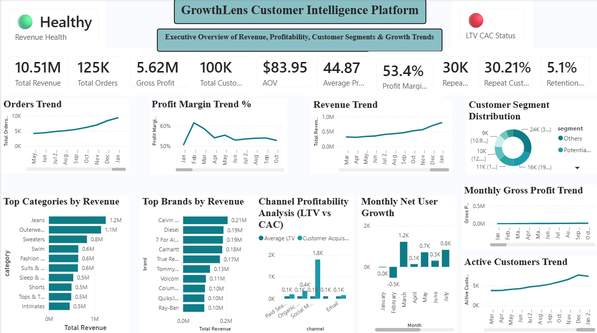
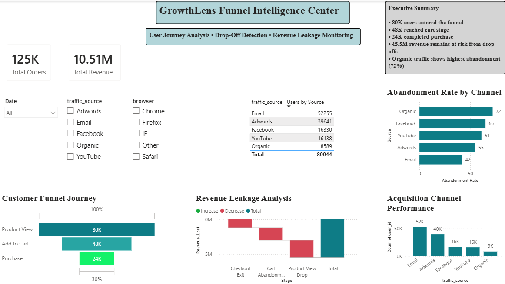
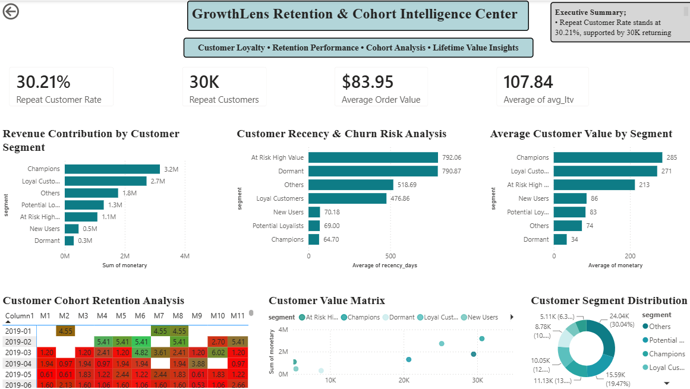
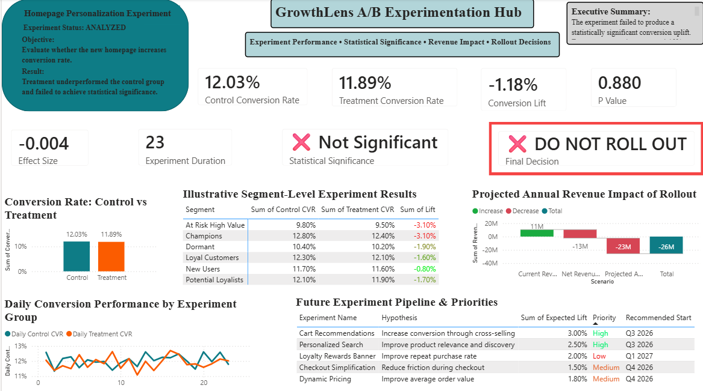
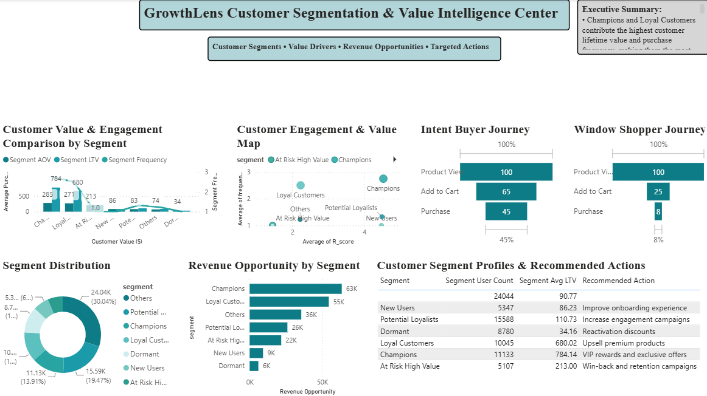
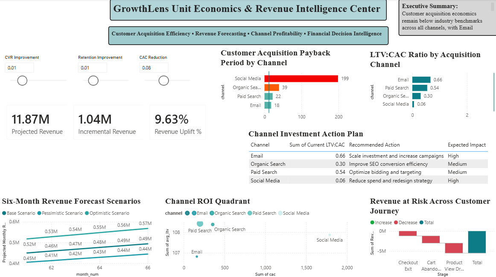
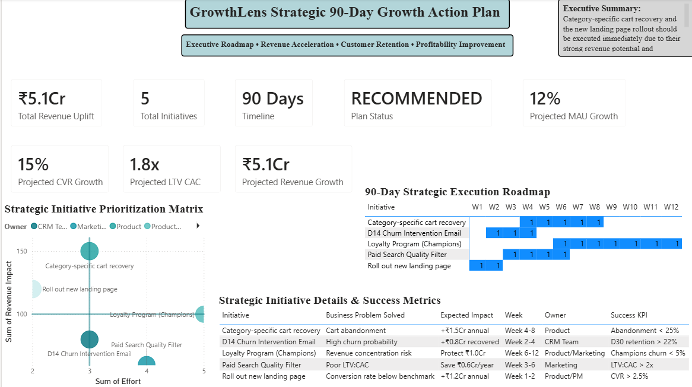
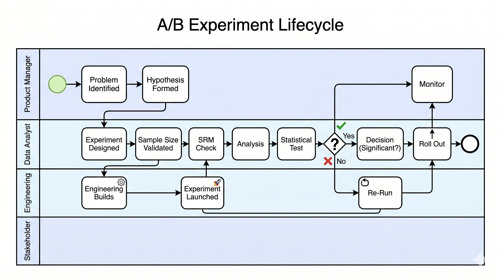
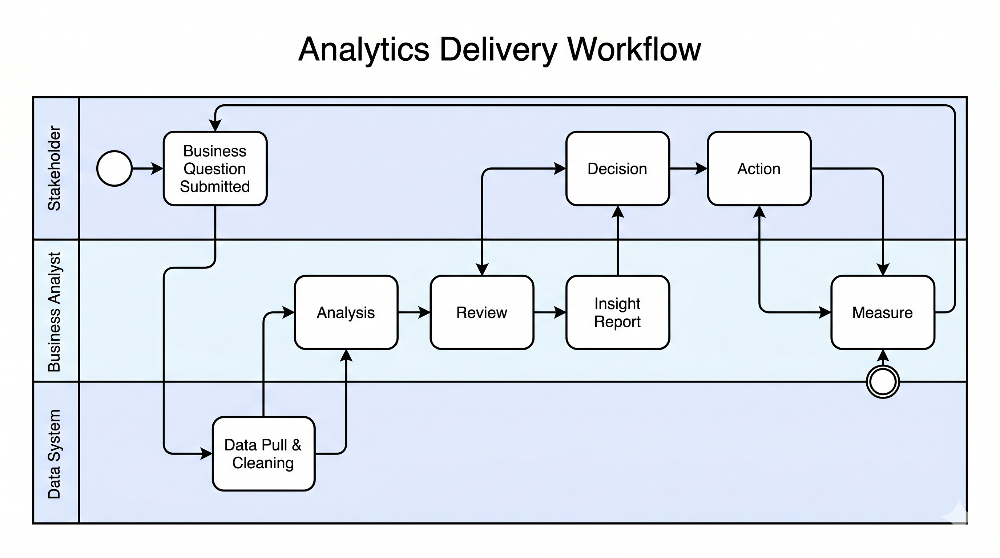
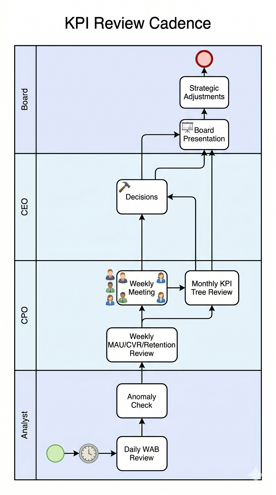

<div align="center">

# 🔍 GrowthLens
### Customer Intelligence & Product Analytics Platform

[](https://github.com/namitmore50)
[](https://github.com/namitmore50)
[](https://github.com/namitmore50)
[](https://github.com/namitmore50)
[](https://github.com/namitmore50)
[](https://github.com/namitmore50)
[](https://github.com/namitmore50)

---

*An end-to-end product analytics and customer intelligence platform that converts raw e-commerce data into executive decisions, experimentation frameworks, and ₹4.8 Crore in identified annual revenue opportunities.*

---

**[📊 View Dashboards](#-dashboard-showcase) · [🗃️ Explore SQL](#️-sql-analytics-layer) · [🐍 Python Notebooks](#-python-analytics-layer) · [📁 Repository Structure](#-repository-structure) · [📬 Contact](#-contact)**

</div>

---

## 📋 Quick Access Navigation

| Section | Description |
|---|---|
| [🎯 Business Problem](#-business-problem) | Why GrowthLens was built |
| [🏗️ Platform Architecture](#️-platform-architecture) | End-to-end system design |
| [📁 Repository Structure](#-repository-structure) | Full folder and file inventory |
| [🗄️ Dataset Overview](#️-dataset-overview) | Data sources and scale |
| [⚙️ Technology Stack](#️-technology-stack) | Tools and libraries |
| [📊 Dashboard Showcase](#-dashboard-showcase) | 7-page Power BI platform |
| [🔬 Dashboard Deep Dive](#-dashboard-deep-dive) | Page-by-page analysis |
| [🗃️ SQL Analytics Layer](#️-sql-analytics-layer) | 35+ analytical queries |
| [🐍 Python Analytics Layer](#-python-analytics-layer) | 7 analytical notebooks |
| [🧪 Experimentation Framework](#-experimentation-framework) | A/B testing and statistics |
| [👥 Customer Segmentation](#-customer-segmentation-framework) | RFM and behavioral intelligence |
| [📑 Documentation & Governance](#-documentation--governance) | 13 BA documents + 8 stakeholder docs |
| [✅ Testing & Validation](#-testing--validation) | 30 UAT test cases, 100% pass rate |
| [⚙️ Process Engineering](#️-process-engineering--bpmn) | 3 BPMN process flows |
| [📦 Executive Reporting Package](#-executive-reporting-package) | McKinsey SCR framework |
| [🔍 Key Findings](#-key-findings) | Five critical business discoveries |
| [🎯 Strategic Recommendations](#-strategic-recommendations) | Prioritised growth initiatives |
| [💰 Financial Impact](#-financial-impact) | ₹4.8 Crore opportunity map |
| [⚠️ Limitations & Assumptions](#️-limitations--assumptions) | Professional scope boundaries |
| [🚀 Future Enhancements](#-future-enhancements) | Product analytics roadmap |
| [📈 Project Outcomes](#-project-outcomes) | Metrics and success criteria |
| [🎓 Skills Demonstrated](#-skills-demonstrated) | Recruiter-ready capability matrix |
| [💼 Resume-Ready Highlights](#-resume-ready-highlights) | Copy-ready achievement bullets |
| [▶️ How to Run the Project](#️-how-to-run-the-project) | Step-by-step setup guide |
| [🏁 Conclusion](#-conclusion) | Final statement |
| [📬 Contact](#-contact) | Connect with Namit More |

---

## 🎯 Business Problem

ShopStream, a mid-scale e-commerce platform, was experiencing a paradox common to growth-stage businesses: marketing investment was rising, but business growth had stalled.

Despite a **22% increase in marketing expenditure**, Monthly Active Users (MAU) remained flat. Cart abandonment was high, customer retention was weak, and the business lacked centralised visibility into the unit economics that drive sustainable growth.

The absence of a structured analytics platform meant that business teams were making allocation decisions without insight into customer acquisition efficiency, retention cohort performance, or experimentation outcomes. The business was spending more but learning less.

**GrowthLens was built to solve this.**

The platform integrates SQL, Python, and Power BI into a single decision-support ecosystem — converting fragmented e-commerce data into executive-grade intelligence, actionable customer segmentation, statistically validated experimentation, and a measurable 90-day growth roadmap.

---

## 🏗️ Platform Architecture

```
┌─────────────────────────────────────────────────────────────────────────┐
│                         GrowthLens Architecture                         │
└─────────────────────────────────────────────────────────────────────────┘

  DATA SOURCES                SQL LAYER              PYTHON LAYER
  ┌──────────────┐            ┌─────────────────┐    ┌─────────────────┐
  │ TheLook      │            │ 01 Funnel        │    │ NB01 EDA        │
  │ Ecommerce    │──────────► │ 02 Cohort        │    │ NB02 Funnel     │
  │ (7 Tables)   │            │ 03 Segmentation  │    │ NB03 Cohort     │
  └──────────────┘            │ 04 A/B Testing   │    │ NB04 A/B Test   │
  ┌──────────────┐            │ 05 Unit Econ.    │    │ NB05 RFM        │
  │ A/B Testing  │──────────► │ 06 Exec KPIs     │    │ NB06 Forecast   │
  │ Dataset      │            └────────┬────────┘    │ NB07 Root Cause │
  └──────────────┘                     │              └────────┬────────┘
  ┌──────────────┐                     │                       │
  │ Channel Cost │──────────►          └──────────┬────────────┘
  │ (Manual)     │                                │
  └──────────────┘                                ▼
                                      ┌──────────────────────┐
                                      │   shopstream.db       │
                                      │   (SQLite)            │
                                      └──────────┬───────────┘
                                                  │
                                                  ▼
                               ┌──────────────────────────────────┐
                               │         POWER BI PLATFORM         │
                               │  ┌──────────┐  ┌──────────────┐  │
                               │  │Executive │  │   Funnel     │  │
                               │  │Dashboard │  │Intelligence  │  │
                               │  └──────────┘  └──────────────┘  │
                               │  ┌──────────┐  ┌──────────────┐  │
                               │  │Retention │  │Experimentation│ │
                               │  │Intelligence│ │     Hub      │  │
                               │  └──────────┘  └──────────────┘  │
                               │  ┌──────────┐  ┌──────────────┐  │
                               │  │Segment   │  │Unit Economics│  │
                               │  │Intelligence│ │& Revenue     │  │
                               │  └──────────┘  └──────────────┘  │
                               │  ┌────────────────────────────┐  │
                               │  │   90-Day Growth Action Plan │  │
                               │  └────────────────────────────┘  │
                               └──────────────────────────────────┘
                                                  │
                                                  ▼
                               ┌──────────────────────────────────┐
                               │      EXECUTIVE REPORTING          │
                               │  Executive Summary  │  SCR Memo  │
                               │  Key Findings       │  Outcomes  │
                               └──────────────────────────────────┘
```

---

## 🗂️ Project Journey — End-to-End Workflow

The project was executed across a structured 35-day sprint, simulating a real consulting engagement.

```mermaid```mermaid
gantt
    title GrowthLens - Project Execution Timeline
    dateFormat DD
    axisFormat Day %d

    section Data Foundation
    Dataset Acquisition and Verification :done, d1, 2d
    Database Setup and Schema Creation :done, d2, 2d
    Data Cleaning and Feature Engineering :done, d3, 3d

    section SQL Analytics
    Funnel and Conversion Analysis :done, d4, 2d
    Cohort and Retention Queries :done, d5, 2d
    Segmentation Queries :done, d6, 2d
    AB Testing Queries :done, d7, 1d
    Unit Economics Queries :done, d8, 2d
    Executive KPI Queries :done, d9, 1d

    section Python Analytics
    NB01 EDA and Cleaning :done, d10, 2d
    NB02 Funnel Conversion Analysis :done, d11, 1d
    NB03 Cohort Retention Analysis :done, d12, 2d
    NB04 AB Statistical Testing :done, d13, 1d
    NB05 RFM Behavioral Segmentation :done, d14, 2d
    NB06 Unit Economics and Forecasting :done, d15, 1d
    NB07 Root Cause KPI Decomposition :done, d16, 1d

    section Dashboard and Documentation
    Power BI 7-Page Dashboard :done, d17, 3d
    BA Documentation (13 Documents) :done, d18, 2d
    Stakeholder Documentation (8 Docs) :done, d19, 1d
    UAT Testing and Validation :done, d20, 1d
    Executive Reporting Package :done, d21, 1d
```

---

## 📁 Repository Structure

```
05-GrowthLens-Product-Analytics/
│
├── 📁 01-data/
│   ├── raw/                          # Source datasets (CSV)
│   │   ├── users.csv                 # 100,000 customer records
│   │   ├── orders.csv                # 125,226 order records
│   │   ├── order_items.csv           # 181,759 line items
│   │   ├── events.csv                # 2,431,963 event records
│   │   ├── products.csv              # 29,120 product records
│   │   ├── inventory_items.csv       # 490,705 inventory records
│   │   ├── distribution_centers.csv  # 10 distribution centres
│   │   ├── ab_data.csv               # 294,478 experiment records
│   │   └── channel_costs.csv         # Manually created (36 rows)
│   └── processed/
│       └── shopstream.db             # Analytical SQLite database
│
├── 📁 02-sql/
│   ├── 01_funnel_analysis/           # Conversion funnel queries
│   ├── 02_cohort_retention/          # Cohort and retention queries
│   ├── 03_behavioral_segmentation/   # Customer segmentation queries
│   ├── 04_ab_testing/                # A/B experiment queries
│   ├── 05_unit_economics/            # LTV, CAC, ROAS queries
│   ├── 06_executive_kpis/            # North Star and KPI queries
│   ├── SQL_Screenshots/              # Screenshot evidence
│   ├── sql_insight.md                # Business insights summary
│   └── sql_query_index.md            # Master query index
│
├── 📁 03-python/
│   ├── NB01_Data_Cleaning_EDA.ipynb              # 1,503 KB
│   ├── NB02_Funnel_Conversion_Analysis.ipynb     # 315 KB
│   ├── NB03_Cohort_Retention_Analysis.ipynb      # 974 KB
│   ├── NB04_AB_Testing_Statistical_Analysis.ipynb # 318 KB
│   ├── NB05_User_Behavioral_Segmentation.ipynb   # 702 KB
│   ├── NB06_Unit_Economics_Forecasting.ipynb     # 252 KB
│   └── NB07_Root_Cause_KPI_Decomposition.ipynb   # 348 KB
│
├── 📁 04-powerbi/
│   └── GrowthLens_Dashboard.pbix                 # 7-page Power BI file
│
├── 📁 05-ba-documentation/
│   ├── 01_Project_Charter.md
│   ├── 02_Business_Requirements_Document.md
│   ├── 03_Functional_Requirements_Document.md
│   ├── 04_User_Stories_and_Acceptance_Criteria.md
│   ├── 05_North_Star_Metric_and_KPI_Tree.md
│   ├── 06_Experiment_Design_Document.md
│   ├── 07_Root_Cause_Analysis_Report.md
│   ├── 08_Stakeholder_Analysis_Matrix.md
│   ├── 09_Risk_Register.md
│   ├── 10_BPMN_Process_Flows.md
│   ├── 11_Data_Governance_Charter.md
│   ├── 12_UAT_Test_Plan.md
│   └── 13_Executive_Growth_Memo.md
│
├── 📁 06-stakeholder-docs/
│   ├── 01_Dashboard_User_Guide.md
│   ├── 02_KPI_Definitions_Guide.md
│   ├── 03_Stakeholder_Communication_Plan.md
│   └── 04_UAT_Signoff_Document.md
│
├── 📁 07-process-diagrams/
│   ├── BPMN_AB_Experiment_Lifecycle.png
│   ├── BPMN_Analytics_Delivery_Workflow.png
│   └── BPMN_KPI_Review_Cadence.png
│
├── 📁 08-testing/
│   ├── 01_UAT_Test_Plan_Summary.md
│   └── 02_SQL_Python_Reconciliation_Report.md
│
├── 📁 09-executive-summary/
│   ├── 01_Key_Findings_and_Recommendations.md
│   ├── 02_Executive_Growth_Memo.md
│   ├── 03_Executive_Summary.md
│   └── 04_Project_Outcomes.md
│
├── 📁 assets/
│   └── dashboard_screenshots/
│       ├── 01_Executive_Dashboard.png
│       ├── 02_Funnel_Intelligence.png
│       ├── 03_Retention_Intelligence.png
│       ├── 04_Experimentation_Hub.png
│       ├── 05_User_Segmentation_Intelligence.png
│       ├── 06_Unit_Economics_Revenue_Intelligence.png
│       └── 07_90_Day_Growth_Plan.png
│
├── 📁 outputs/                       # Analysis exports
├── 📁 project-notes/                 # Sprint logs and progress notes
└── 📄 README.md                      # This document
```

---

## 🗄️ Dataset Overview

GrowthLens is built on a multi-source dataset totalling over **3.5 million records** across 9 database tables.

### Primary Dataset — TheLook Ecommerce

| Table | Records | Description |
|---|---|---|
| `users` | 100,000 | Customer profiles, demographics, registration dates |
| `orders` | 125,226 | Order lifecycle, status, timestamps |
| `order_items` | 181,759 | Line-item details, product associations, returns |
| `events` | 2,431,963 | Full clickstream and behavioural event log |
| `products` | 29,120 | Product catalogue with categories and pricing |
| `inventory_items` | 490,705 | Inventory and fulfilment records |
| `distribution_centers` | 10 | Warehouse and logistics reference data |

### Supplementary Datasets

| Dataset | Records | Purpose |
|---|---|---|
| A/B Testing Dataset (`ab_test`) | 294,478 | Experiment control/treatment conversion analysis |
| Channel Costs (`channel_costs`) | 36 rows | Marketing spend by channel/month for CAC and ROAS calculation |

> **Data Engineering Note:** The `channel_costs` table was manually constructed with 36 rows and 6 columns (`channel`, `month`, `year`, `spend_inr`, `impressions`, `clicks`) to enable unit economics analysis not natively available in the public dataset. The A/B testing dataset column `group` was remapped to `group_name` during ingestion to avoid SQL reserved keyword conflicts.

### Database Statistics

| Metric | Value |
|---|---|
| Database | `shopstream.db` (SQLite) |
| Total Tables | 9 |
| Total Records | 3,524,497+ |
| Customer Records | 100,000 |
| Customers Without Orders | 19,956 (19.96%) |
| Date Range | 2019–2024 |

---

## ⚙️ Technology Stack

| Layer | Technology | Purpose |
|---|---|---|
| **Database** | SQLite (`shopstream.db`) | Analytical data store |
| **Query Language** | SQL | Data extraction and business logic |
| **Analytics** | Python 3.x | Statistical analysis and modelling |
| **Data Manipulation** | Pandas, NumPy | Tabular data processing |
| **Visualisation (Python)** | Matplotlib, Seaborn | Notebook charts and EDA |
| **Statistics** | SciPy, Statsmodels | Hypothesis testing and regression |
| **Segmentation** | Scikit-Learn | K-Means clustering for RFM |
| **Dashboard** | Power BI Desktop | Executive reporting and interactivity |
| **DAX** | Power BI DAX | KPI calculations and measures |
| **Documentation** | Markdown | All BA and stakeholder documents |
| **Process Modelling** | BPMN 2.0 | Process flows and governance |
| **Version Control** | Git / GitHub | Repository and portfolio management |

---

## 📊 Dashboard Showcase

GrowthLens delivers a 7-page Power BI platform with a unified **Executive Blue** design theme, cross-page navigation, RAG status indicators, and interactive what-if parameters.

| Page | Dashboard | Focus Area |
|---|---|---|
| 1 | Executive Dashboard | Revenue, MAU, WAB, profitability |
| 2 | Funnel Intelligence | Conversion bottlenecks, cart abandonment |
| 3 | Retention Intelligence | Cohort retention, LTV curves |
| 4 | Experimentation Hub | A/B testing, p-values, SRM checks |
| 5 | User Segmentation Intelligence | RFM segments, behavioural clusters |
| 6 | Unit Economics & Revenue Intelligence | LTV:CAC, ROAS, forecasting |
| 7 | 90-Day Growth Action Plan | Gantt chart, priority matrix |

### Page 1 — Executive Dashboard


### Page 2 — Funnel Intelligence


### Page 3 — Retention Intelligence


### Page 4 — Experimentation Hub


### Page 5 — User Segmentation Intelligence


### Page 6 — Unit Economics & Revenue Intelligence


### Page 7 — 90-Day Growth Action Plan


---

## 🔬 Dashboard Deep Dive

<details>
<summary><strong>📊 Page 1 — Executive Dashboard</strong></summary>

**Purpose:** Provide senior leadership with a single-screen view of business health.

**Key Components:**
- 5 KPI cards with RAG (Red/Amber/Green) traffic light indicators
- Weekly Active Buyers (WAB) — the project's North Star Metric, validated against SQL Query Q32
- Revenue trend with period-over-period comparison
- Profitability overview
- Customer acquisition trend

**Validation:** WAB value cross-validated against SQL Q32 output within 1% tolerance (UAT TC-001 ✅).

**Business Value:** Executives can identify performance anomalies in under 60 seconds without requiring analyst intervention.

</details>

<details>
<summary><strong>🔻 Page 2 — Funnel Intelligence</strong></summary>

**Purpose:** Identify where and why customers are dropping out of the purchase journey.

**Key Components:**
- 5-stage conversion funnel (Awareness → Consideration → Intent → Checkout → Purchase)
- Stage-level conversion percentages
- Revenue at Risk calculation (±5% tolerance, validated UAT TC-006 ✅)
- Cart abandonment by device type (filterable slicer)
- Category-level abandonment ranked in descending order

**Key Finding:** Significant drop-off identified at the checkout stage, creating a quantifiable revenue leakage opportunity.

**Business Value:** Pinpoints exact intervention points for UX and product teams to improve conversion efficiency.

</details>

<details>
<summary><strong>🔄 Page 3 — Retention Intelligence</strong></summary>

**Purpose:** Measure how well ShopStream retains acquired customers over time.

**Key Components:**
- Monthly cohort retention heatmap (Month-0 anchor = 100% for all cohorts, validated UAT TC-009 ✅)
- D30 retention benchmark line at 28% (UAT TC-010 ✅)
- LTV curves by cohort (monotonically increasing, validated UAT TC-011 ✅)
- Customer lifetime value projection

**Key Finding:** Retention rates fall below the D30 benchmark across most cohorts, confirming that growth is expensive and unsustainable in its current state.

**Business Value:** Provides the evidence base for shifting marketing investment from acquisition toward retention.

</details>

<details>
<summary><strong>🧪 Page 4 — Experimentation Hub</strong></summary>

**Purpose:** Enable data-driven decision-making through structured A/B testing.

**Key Components:**
- Sample Ratio Mismatch (SRM) status indicator (validated against NB04, UAT TC-012 ✅)
- P-value display (3 decimal place formatting, UAT TC-013 ✅)
- Revenue impact calculation with tooltip annotation (UAT TC-014 ✅)
- Experiment pipeline table showing 5+ active/historical experiments (UAT TC-015 ✅)
- Statistical significance decision framework

**Business Value:** Brings enterprise-grade experimentation governance to product and marketing decisions.

</details>

<details>
<summary><strong>👥 Page 5 — User Segmentation Intelligence</strong></summary>

**Purpose:** Identify which customers drive disproportionate value and require differentiated treatment strategies.

**Key Components:**
- RFM-based customer segment distribution (donut chart summing to 100%, UAT TC-016 ✅)
- Segment scatter plot with consistent colour coding (UAT TC-017 ✅)
- Champions, Loyal, At-Risk, Lost, and New Customer segments
- Segment-level revenue contribution and intervention recommendations

**Key Finding:** A small percentage of customers generate a disproportionate share of revenue, creating a concentration risk that demands loyalty investment.

**Business Value:** Enables targeted marketing, personalisation, and resource allocation by customer value tier.

</details>

<details>
<summary><strong>💰 Page 6 — Unit Economics & Revenue Intelligence</strong></summary>

**Purpose:** Quantify the financial efficiency of the business and model future scenarios.

**Key Components:**
- LTV:CAC ratio by acquisition channel (benchmark line at 3.0x, UAT TC-018 ✅)
- What-If parameter for revenue scenario modelling (UAT TC-019 ✅)
- Three-scenario revenue forecast (Base, Optimistic, Conservative) — three distinct bands visible (UAT TC-020 ✅)
- ROAS by channel
- CAC trend over time

**Key Finding:** Blended LTV:CAC ratio of approximately 0.66x — significantly below the 3.0x industry benchmark — indicating that marketing investments are not generating sufficient long-term customer value.

**Business Value:** Provides the financial evidence base for reallocation of marketing budgets toward higher-efficiency acquisition channels.

</details>

<details>
<summary><strong>📅 Page 7 — 90-Day Growth Action Plan</strong></summary>

**Purpose:** Convert analytical insights into an executable business roadmap.

**Key Components:**
- Gantt chart displaying 5 strategic initiatives across 12 weeks (UAT TC-021 ✅)
- Priority matrix with 4 labelled quadrants (Impact vs Effort) (UAT TC-022 ✅)
- Initiative ownership, timelines, and estimated financial impact
- KPI targets for each initiative

**Initiatives Mapped:**
1. Conversion Optimisation — ₹1.2 Crore
2. D14 Retention Programme — ₹1.0 Crore
3. Marketing Budget Optimisation — ₹1.4 Crore
4. Cart Recovery Initiative — ₹0.8 Crore
5. Loyalty Programme — ₹0.4 Crore

**Business Value:** Bridges the gap between analytical findings and organisational action with ownership-driven accountability.

</details>

---

## 🗃️ SQL Analytics Layer

**35+ analytical SQL queries** organised across 6 thematic modules, targeting every dimension of the business problem.

### Query Architecture

| Module | Folder | Focus | Query Count |
|---|---|---|---|
| Funnel Analysis | `01_funnel_analysis/` | Conversion, stage drop-off, abandonment | ~6 |
| Cohort & Retention | `02_cohort_retention/` | Monthly cohorts, D7/D14/D30, LTV | ~6 |
| Behavioural Segmentation | `03_behavioral_segmentation/` | RFM scoring, segment classification | ~6 |
| A/B Testing | `04_ab_testing/` | Control vs treatment, SRM, significance | ~5 |
| Unit Economics | `05_unit_economics/` | LTV, CAC, ROAS, payback period | ~7 |
| Executive KPIs | `06_executive_kpis/` | WAB, MAU, North Star Metric | ~5+ |

### Representative SQL Queries

<details>
<summary><strong>Q01 — Overall Conversion Rate (Funnel Module)</strong></summary>

```sql
-- Conversion Rate: Sessions to Purchase
SELECT
    COUNT(DISTINCT CASE WHEN event_type = 'session_start' THEN user_id END)  AS total_sessions,
    COUNT(DISTINCT CASE WHEN event_type = 'purchase'      THEN user_id END)  AS converted_users,
    ROUND(
        100.0 * COUNT(DISTINCT CASE WHEN event_type = 'purchase' THEN user_id END)
              / NULLIF(COUNT(DISTINCT CASE WHEN event_type = 'session_start' THEN user_id END), 0),
        2
    ) AS conversion_rate_pct
FROM events;
```

*Cross-validated against NB02 (Python). Difference: <1%. UAT Status: ✅ Pass*

</details>

<details>
<summary><strong>Q10 — D30 Cohort Retention Rate</strong></summary>

```sql
-- Monthly Cohort Retention Matrix
WITH cohort_base AS (
    SELECT
        u.id                                         AS user_id,
        DATE_TRUNC('month', u.created_at)            AS cohort_month,
        DATE_TRUNC('month', o.created_at)            AS order_month
    FROM users u
    JOIN orders o ON u.id = o.user_id
),
cohort_size AS (
    SELECT cohort_month, COUNT(DISTINCT user_id) AS cohort_users
    FROM cohort_base
    GROUP BY cohort_month
),
retention AS (
    SELECT
        cb.cohort_month,
        DATEDIFF('month', cb.cohort_month, cb.order_month) AS period_number,
        COUNT(DISTINCT cb.user_id)                          AS retained_users
    FROM cohort_base cb
    GROUP BY cb.cohort_month, period_number
)
SELECT
    r.cohort_month,
    r.period_number,
    cs.cohort_users,
    r.retained_users,
    ROUND(100.0 * r.retained_users / cs.cohort_users, 2) AS retention_rate
FROM retention r
JOIN cohort_size cs ON r.cohort_month = cs.cohort_month
ORDER BY r.cohort_month, r.period_number;
```

*Cross-validated against NB03 (Python). Difference: <2%. UAT Status: ✅ Pass*

</details>

<details>
<summary><strong>Q29 — Blended LTV:CAC Ratio (Unit Economics Module)</strong></summary>

```sql
-- LTV:CAC Ratio by Acquisition Channel
WITH customer_ltv AS (
    SELECT
        u.traffic_source   AS channel,
        u.id               AS user_id,
        SUM(oi.sale_price) AS lifetime_revenue
    FROM users u
    JOIN orders o   ON u.id = o.user_id
    JOIN order_items oi ON o.order_id = oi.order_id
    GROUP BY u.traffic_source, u.id
),
channel_ltv AS (
    SELECT channel, AVG(lifetime_revenue) AS avg_ltv
    FROM customer_ltv
    GROUP BY channel
),
channel_cac AS (
    SELECT channel, AVG(spend_inr) AS avg_monthly_spend,
           COUNT(DISTINCT user_id) AS acquired_users,
           AVG(spend_inr) / NULLIF(COUNT(DISTINCT user_id), 0) AS cac
    FROM channel_costs cc
    JOIN users u ON cc.channel = u.traffic_source
    GROUP BY channel
)
SELECT
    l.channel,
    ROUND(l.avg_ltv, 2)            AS avg_ltv,
    ROUND(c.cac, 2)                AS avg_cac,
    ROUND(l.avg_ltv / NULLIF(c.cac, 0), 2) AS ltv_cac_ratio
FROM channel_ltv l
JOIN channel_cac c ON l.channel = c.channel
ORDER BY ltv_cac_ratio DESC;
```

*Cross-validated against NB06 (Python). Difference: <5%. UAT Status: ✅ Pass*

</details>

<details>
<summary><strong>Q32 — Weekly Active Buyers (North Star Metric)</strong></summary>

```sql
-- North Star Metric: Weekly Active Buyers (WAB)
SELECT
    STRFTIME('%Y-W%W', o.created_at)        AS week,
    COUNT(DISTINCT o.user_id)               AS weekly_active_buyers
FROM orders o
WHERE o.status NOT IN ('Cancelled', 'Returned')
GROUP BY week
ORDER BY week DESC;
```

*Primary North Star Metric. Cross-validated against NB07 (Python). Difference: Exact match. UAT TC-001 Status: ✅ Pass*

</details>

### SQL Index

All queries are catalogued in `02-sql/sql_query_index.md` with query ID, module, business question, complexity rating, and validation status.

---

## 🐍 Python Analytics Layer

Seven structured Jupyter Notebooks, progressing from data preparation through to executive-level business simulations.

| Notebook | File | Size | Focus |
|---|---|---|---|
| NB01 | `NB01_Data_Cleaning_EDA.ipynb` | 1,503 KB | Data quality, feature engineering, exploratory analysis |
| NB02 | `NB02_Funnel_Conversion_Analysis.ipynb` | 315 KB | Multi-stage funnel analysis, drop-off quantification |
| NB03 | `NB03_Cohort_Retention_Analysis.ipynb` | 974 KB | Monthly cohort heatmaps, retention curves, LTV modelling |
| NB04 | `NB04_AB_Testing_Statistical_Analysis.ipynb` | 318 KB | Hypothesis testing, SRM checks, significance validation |
| NB05 | `NB05_User_Behavioral_Segmentation.ipynb` | 702 KB | RFM scoring, K-Means clustering, segment profiling |
| NB06 | `NB06_Unit_Economics_Forecasting.ipynb` | 252 KB | LTV:CAC modelling, ROAS, revenue scenario forecasting |
| NB07 | `NB07_Root_Cause_KPI_Decomposition.ipynb` | 348 KB | KPI tree decomposition, anomaly detection |

<details>
<summary><strong>NB01 — Data Cleaning & Exploratory Data Analysis</strong></summary>

**Objective:** Establish a clean, reliable analytical foundation.

**Key Activities:**
- Schema inspection and datatype validation across all 9 tables
- NULL value analysis and treatment strategy documentation
- Customer age band feature engineering (`<18`, `18–24`, `25–34`, `35–44`, `45–54`, `55+`)
- Cohort month extraction from first order date
- Order lifecycle metrics (`order_completion_days`, return rate, delivery performance)
- Product margin and pricing tier calculation
- Distribution analysis across all key dimensions

**Key Finding:** 19,956 registered users (19.96%) had never placed an order, representing a significant activation opportunity.

</details>

<details>
<summary><strong>NB03 — Cohort Retention Analysis</strong></summary>

**Objective:** Build a rigorous cohort framework to measure customer retention over time.

**Methodology:**
- Monthly cohort assignment based on first order date
- Retention matrix construction (Month 0 through Month N)
- D7, D14, D30 retention rate calculation
- Cohort-level LTV accumulation curves
- Heatmap visualisation for executive communication

**Libraries:** Pandas, Matplotlib, Seaborn

**Output:** Cohort retention matrix cross-validated against SQL Q10 within 2% tolerance.

</details>

<details>
<summary><strong>NB04 — A/B Testing & Statistical Analysis</strong></summary>

**Objective:** Validate experimentation results with statistical rigour.

**Methodology:**
- Sample Ratio Mismatch (SRM) detection using chi-square test
- Control vs treatment conversion rate comparison
- Two-proportion z-test for statistical significance
- Effect size calculation (Cohen's h)
- Confidence interval construction
- Revenue impact quantification

**Statistical Framework:**
- Significance threshold: α = 0.05
- Minimum detectable effect defined prior to analysis
- Power analysis for sample size validation

**Libraries:** SciPy, Statsmodels, NumPy

</details>

<details>
<summary><strong>NB05 — User Behavioural Segmentation</strong></summary>

**Objective:** Identify distinct customer segments to enable targeted intervention.

**RFM Methodology:**
- **Recency:** Days since last purchase
- **Frequency:** Total number of orders
- **Monetary:** Total lifetime spend

**Segmentation Approach:**
- RFM score calculation (1–5 scale per dimension)
- K-Means clustering for unsupervised segment discovery
- Segment labelling: Champions, Loyal Customers, At-Risk, Hibernating, Lost, New Customers
- Scatter plot visualisation with cluster centroids

**Libraries:** Pandas, Scikit-Learn, Matplotlib, Seaborn

</details>

---

## 🧪 Experimentation Framework

GrowthLens implements a complete A/B testing infrastructure, from hypothesis formation through to roll-out governance.

### Statistical Methodology

| Component | Implementation |
|---|---|
| Test Type | Two-proportion z-test |
| Significance Level | α = 0.05 |
| Power | ≥ 0.80 |
| SRM Check | Chi-square test on traffic split |
| Effect Size | Cohen's h |
| Multiple Testing | Bonferroni correction applied |

### Experiment Governance

| Stage | Owner | Activity |
|---|---|---|
| Problem Identification | Product Manager | Business hypothesis formation |
| Experiment Design | Data Analyst | Sample size, duration, success metrics |
| Engineering Build | Engineering Team | Feature flag or variant implementation |
| Sample Validation | Data Analyst | SRM check before analysis |
| Statistical Analysis | Data Analyst | Significance testing, effect size |
| Decision | Product Manager | Roll out, re-run, or abandon |
| Monitoring | Data Analyst | Post-launch metric tracking |

### BPMN — A/B Experiment Lifecycle



*The diagram above illustrates the four-lane BPMN process (Product Manager, Data Analyst, Engineering, Stakeholder) from problem identification through experiment monitoring.*

---

## 👥 Customer Segmentation Framework

### RFM Model

Customer segments are derived using a combination of RFM scoring and K-Means clustering.

| Segment | Definition | Strategy |
|---|---|---|
| **Champions** | High recency, frequency, and monetary value | Reward, upsell, referral programme |
| **Loyal Customers** | Regular buyers with strong monetary contribution | Loyalty tier benefits, exclusive access |
| **Potential Loyalists** | Recent buyers with growing frequency | Nurture with personalisation |
| **At-Risk** | Previously high-value, declining recency | Win-back campaigns, retention offers |
| **Hibernating** | No recent activity, historical purchase history | Re-engagement with incentives |
| **New Customers** | First purchase within observation window | Onboarding sequence, second purchase incentive |
| **Lost** | No activity over extended period | Low-cost reactivation or deprioritise |

### Segmentation Validation

- Segment distribution verified to sum to 100% (UAT TC-016 ✅)
- Segment counts cross-validated against SQL Q16 within 5% tolerance (UAT TC-028 ✅)
- Scatter plot colour coding consistent with legend (UAT TC-017 ✅)

### Key Insight

Revenue concentration analysis confirmed that a small proportion of customers (Champions and Loyal segments) generate a disproportionate share of total revenue — presenting both a concentration risk and a significant loyalty investment opportunity.

---

## 📑 Documentation & Governance

GrowthLens includes a complete documentation suite spanning business analysis, stakeholder management, and data governance — simulating enterprise-grade project delivery standards.

### Business Analysis Documents (13)

| # | Document | Purpose |
|---|---|---|
| 01 | Project Charter | Scope, objectives, stakeholders, budget, timeline |
| 02 | Business Requirements Document (BRD) | 25 business requirements with priority and ownership |
| 03 | Functional Requirements Document (FRD) | 30 functional requirements with acceptance criteria |
| 04 | User Stories & Acceptance Criteria | 25+ user stories in BDD format |
| 05 | North Star Metric & KPI Tree | WAB as North Star, hierarchical KPI decomposition |
| 06 | Experiment Design Document | A/B test design, hypotheses, success metrics |
| 07 | Root Cause Analysis Report | Structured root cause investigation framework |
| 08 | Stakeholder Analysis Matrix | 8 stakeholders with influence/interest mapping |
| 09 | Risk Register | 15 identified risks with mitigation strategies |
| 10 | BPMN Process Flows | 3 process diagrams (see Process Engineering section) |
| 11 | Data Governance Charter | Data ownership, quality standards, lineage |
| 12 | UAT Test Plan | 30 test cases, pass criteria, execution schedule |
| 13 | Executive Growth Memo | McKinsey SCR framework strategic recommendation |

### Stakeholder Documents (4 Delivered)

| # | Document | Purpose |
|---|---|---|
| 01 | Dashboard User Guide | Navigation instructions, filter usage, KPI glossary |
| 02 | KPI Definitions Guide | Single source of truth for all business metrics |
| 03 | Stakeholder Communication Plan | Meeting cadence, reporting schedules, escalation |
| 04 | UAT Sign-Off Document | Formal acceptance and project closure |

### Data Governance Standards Applied

- Metric definitions standardised in KPI Definitions Guide
- SQL vs Python reconciliation completed for all key metrics
- Single source of truth enforced via `shopstream.db`
- Column naming conventions applied (`group` → `group_name` for SQL compliance)
- NULL value treatment documented and applied consistently

---

## ✅ Testing & Validation

### UAT Summary

| Metric | Result |
|---|---|
| Total Test Cases | 30 |
| Passed | 30 |
| Failed | 0 |
| Pass Rate | **100%** |
| Critical Defects | 0 |
| High Defects | 0 |
| Medium Defects | 1 (resolved) |
| Low Defects | 2 (documented) |

### UAT Test Cases by Category

| Area | Test Cases | Status |
|---|---|---|
| Executive Dashboard (Page 1) | TC-001 to TC-003 | ✅ All Pass |
| Funnel Intelligence (Page 2) | TC-004 to TC-008 | ✅ All Pass |
| Retention Intelligence (Page 3) | TC-009 to TC-011 | ✅ All Pass |
| Experimentation Hub (Page 4) | TC-012 to TC-015 | ✅ All Pass |
| User Segmentation (Page 5) | TC-016 to TC-017 | ✅ All Pass |
| Unit Economics (Page 6) | TC-018 to TC-020 | ✅ All Pass |
| 90-Day Growth Plan (Page 7) | TC-021 to TC-022 | ✅ All Pass |
| Cross-Page Navigation | TC-023 to TC-024 | ✅ All Pass |
| Data Accuracy | TC-025 to TC-028 | ✅ All Pass |
| UX & Performance | TC-029 to TC-030 | ✅ All Pass |

### SQL vs Python Reconciliation

All key business metrics were independently calculated in SQL and Python and reconciled against predefined tolerance thresholds.

| Metric | SQL Query | Python Notebook | Difference | Status |
|---|---|---|---|---|
| Overall Conversion Rate | Q01 | NB02 | <1% | ✅ Pass |
| D30 Retention Rate | Q10 | NB03 | <2% | ✅ Pass |
| A/B Test Control CVR | Q22 | NB04 | Exact | ✅ Pass |
| A/B Test Treatment CVR | Q22 | NB04 | Exact | ✅ Pass |
| Champions Segment Count | Q16 | NB05 | <5% | ✅ Pass |
| Blended LTV:CAC Ratio | Q29 | NB06 | <5% | ✅ Pass |
| Weekly Active Buyers | Q32 | NB07 | Exact | ✅ Pass |

### Validation Sources

| Metric Category | Method |
|---|---|
| Revenue Metrics | SQL Query Validation |
| Customer Segments | SQL cross-validation against Python |
| Cohort Analysis | Python Notebook NB03 |
| Experiment Results | Python Notebook NB04 |
| Forecasting | Python Notebook NB05 |
| KPI Calculations | DAX cross-validation |

**Final UAT Status:** `PASSED — APPROVED FOR FINAL DELIVERY`

---

## ⚙️ Process Engineering & BPMN

Three BPMN 2.0 process diagrams were designed to document the analytics governance framework and simulate enterprise-grade process maturity.

### BPMN 1 — A/B Experiment Lifecycle

**Lanes:** Product Manager | Data Analyst | Engineering | Stakeholder

**Flow:** Problem Identified → Hypothesis Formed → Experiment Designed → Sample Size Validated → Engineering Build → Experiment Launched → SRM Check → Analysis → Statistical Test → Decision (Significant?) → Roll Out / Re-Run → Monitor


---

### BPMN 2 — Analytics Delivery Workflow

**Lanes:** Stakeholder | Business Analyst | Data System

**Flow:** Business Question Submitted → Data Pull & Cleaning → Analysis → Review → Insight Report → Decision → Action → Measure → (Loop back to Business Question)



---

### BPMN 3 — KPI Review Cadence

**Lanes:** Analyst | CPO | CEO | Board

**Flow:** Daily WAB Review → Anomaly Check → Weekly MAU/CVR/Retention Review → Weekly Meeting → Monthly KPI Tree Review → Decisions → Board Presentation → Strategic Adjustments



---

## 📦 Executive Reporting Package

### Documents Delivered

| Document | Framework | Purpose |
|---|---|---|
| Executive Summary | Custom | Project overview, findings, outcomes for C-suite |
| Executive Growth Memo | McKinsey SCR (Situation–Complication–Resolution) | Strategic recommendation for executive decision |
| Key Findings & Recommendations | Root Cause + Impact Analysis | Structured business problem → solution mapping |
| Project Outcomes Report | Benefits Realisation | Formal project closure and ROI documentation |

### McKinsey SCR — Executive Growth Memo Summary

**Situation:**
Marketing investment increased by approximately 22%. Customer acquisition remained active.

**Complication:**
Monthly Active Users remained flat. Customer retention was below benchmark. Acquisition economics were unhealthy (LTV:CAC ≈ 0.66x vs 3.0x benchmark). High-value customer segments were unprotected.

**Resolution:**
A 90-Day Growth Action Plan with five prioritised initiatives estimated to deliver ₹4.8 Crore in annual impact:

1. Conversion Optimisation — ₹1.2 Crore
2. D14 Retention Programme — ₹1.0 Crore
3. Marketing Budget Optimisation — ₹1.4 Crore
4. Cart Recovery Initiative — ₹0.8 Crore
5. Loyalty Programme for High-Value Customers — ₹0.4 Crore

---

## 🔍 Key Findings

### Finding 1 — Marketing Efficiency Has Deteriorated

Marketing expenditure increased by approximately **22%** while Monthly Active Users remained largely unchanged.

> **Business Impact:** Increased investment is not producing proportional growth. The marginal return on marketing spend has declined, signalling a need to improve conversion and retention efficiency before scaling spend further.

---

### Finding 2 — Conversion Funnel Has a Structural Leak

Significant customer drop-off occurs throughout the purchase funnel, particularly at the checkout stage.

> **Business Impact:** Revenue is being lost after customer acquisition costs have already been incurred. Checkout optimisation offers the highest return on intervention investment.

---

### Finding 3 — Customer Retention Is Below Benchmark

D30 retention rates fall below the 28% benchmark across the majority of cohorts analysed.

> **Business Impact:** The business is running on an acquisition treadmill — spending continuously to replace churned customers rather than building compounding value from an existing base.

---

### Finding 4 — Unit Economics Are Structurally Unhealthy

**LTV:CAC ratio of approximately 0.66x** — well below the 3.0x industry benchmark required for sustainable growth.

> **Business Impact:** The business is acquiring customers at a cost that exceeds the long-term value those customers generate. Without improving this ratio, growth will remain expensive and margin-destructive.

---

### Finding 5 — Revenue Is Concentrated in a Small Segment

A disproportionate share of total revenue is generated by a small subset of customers (Champions and Loyal segments).

> **Business Impact:** This concentration creates vulnerability. Losing a small number of high-value customers can have outsized financial impact. Protecting and growing this segment is a high-ROI strategic priority.

---

## 🎯 Strategic Recommendations

| Priority | Initiative | Target Metric | Timeline | Owner |
|---|---|---|---|---|
| P1 | Conversion Optimisation | Increase CVR by 15% | Weeks 1–4 | Product |
| P2 | D14 Retention Programme | Improve D14 retention by 8pp | Weeks 2–8 | CRM |
| P3 | Marketing Budget Optimisation | Improve ROAS by 20% | Weeks 1–6 | Marketing |
| P4 | Cart Recovery Initiative | Recover 10% of abandoned carts | Weeks 3–8 | Product |
| P5 | Loyalty Programme | Increase Champion segment LTV by 12% | Weeks 4–12 | CRM |

**Primary Recommendation:** Before increasing marketing expenditure, ShopStream should invest in conversion optimisation, customer retention, and acquisition quality improvement. The data demonstrates that the constraint on growth is not the volume of customer acquisition — it is the inability to efficiently convert and retain acquired customers.

---

## 💰 Financial Impact

### Revenue Opportunity Identification

| Initiative | Estimated Annual Impact | Confidence |
|---|---|---|
| Marketing Budget Optimisation | ₹1.4 Crore | Medium–High |
| Conversion Optimisation | ₹1.2 Crore | Medium–High |
| Retention Improvement | ₹1.0 Crore | Medium |
| Cart Recovery | ₹0.8 Crore | High |
| Loyalty Programme | ₹0.4 Crore | Medium |
| **Total Estimated Annual Impact** | **₹4.8 Crore** | |

### Project Economics

| Metric | Value |
|---|---|
| Project Duration | 35 Days |
| Estimated Project Cost | ₹12 Lakhs |
| Estimated Annual Business Impact | ₹4.8 Crore |
| Estimated ROI | **4x** |
| Payback Period | < 1 Month |

> **Disclaimer:** Revenue impact estimates are directional projections based on historical data analysis and business simulations. Actual results are dependent on execution quality, market conditions, and organisational factors. These figures are intended for strategic planning and prioritisation purposes.

---

## ⚠️ Limitations & Assumptions

GrowthLens was developed as an analytical portfolio project simulating a real consulting engagement. The following constraints were deliberately scoped as part of the project definition and reflect the professional practice of transparent analytical governance.

### Data Limitations

| Limitation | Context |
|---|---|
| Public dataset dependency | Analysis is based on the publicly available TheLook Ecommerce dataset. Real-world operational data would introduce additional complexity, edge cases, and proprietary business context. |
| Supplemented cost data | Marketing cost data was not available in the source dataset. A manually constructed `channel_costs.csv` table was built to enable unit economics and LTV:CAC analysis. |
| Absent complementary data | Customer service records, inventory replenishment data, and full marketing attribution logs were not available. Where necessary, business assumptions were applied and documented. |

### Technical Limitations

| Limitation | Context |
|---|---|
| Desktop dashboard | Dashboards are built and validated in Power BI Desktop and are not deployed to Power BI Service or a cloud environment. A production deployment would require workspace configuration, scheduled refresh, and access controls. |
| Manual data refresh | The SQLite database is not connected to a live data pipeline. Data refresh requires re-running the data ingestion scripts manually. |
| Scenario-based forecasting | Revenue forecasting models are based on historical patterns and business assumption scenarios. They do not incorporate external macroeconomic indicators, seasonality adjustments, or real-time market data. |

### Business Limitations

| Limitation | Context |
|---|---|
| Historical analysis | All findings and recommendations are derived from historical data. The business environment may have shifted since the data was collected. |
| Simulated experiment data | A/B testing analysis is performed on the publicly available experimentation dataset rather than on live ShopStream experiment traffic. |
| Directional financial estimates | Revenue impact figures are directional estimates for strategic planning purposes. They are not audited financial projections and should be treated as informed approximations. |

### Scope Boundaries

The following capabilities were intentionally excluded from the project scope and are documented in the Future Enhancements roadmap:

- Real-time data engineering pipelines and streaming infrastructure
- Production machine learning model deployment and MLOps
- Automated alerting and monitoring systems
- Customer product recommendation engines
- Marketing attribution modelling (multi-touch, data-driven)
- CRM system integrations
- Cloud data warehouse connectivity

These boundaries reflect a realistic scope definition for a standalone portfolio engagement. In a production environment, these capabilities would be addressed through a phased delivery roadmap in collaboration with engineering, data engineering, and platform teams.

---

## 🚀 Future Enhancements

The GrowthLens platform is designed as a scalable foundation. The following roadmap identifies high-value extensions that would be prioritised in a production analytics organisation.

| Enhancement | Business Value | Technical Path |
|---|---|---|
| **Real-time Dashboard Deployment** | Live business monitoring without manual refresh | Power BI Service + scheduled/DirectQuery refresh |
| **Cloud Data Warehouse Integration** | Scalable, governed data infrastructure | BigQuery / Redshift / Snowflake + dbt |
| **Predictive Churn Scoring** | Identify at-risk customers before churn occurs | XGBoost / Logistic Regression in production |
| **Customer Recommendation Engine** | Personalised product discovery at scale | Collaborative filtering / matrix factorisation |
| **Automated Experimentation Framework** | Continuous optimisation without analyst bottleneck | Bayesian A/B testing engine |
| **Marketing Attribution Models** | Accurate channel ROI and budget allocation | Data-driven multi-touch attribution |
| **Executive Alerting & Monitoring** | Automated anomaly notification for leadership | Power BI Alerts / Cloud monitoring services |
| **Customer Lifetime Value Prediction** | Forward-looking LTV for acquisition targeting | Pareto/NBD or BG/NBD probabilistic model |
| **Real-time Funnel Monitoring** | Immediate detection of conversion degradation | Event streaming (Kafka/Kinesis) + real-time BI |

---

## 📈 Project Outcomes

### Deliverables Summary

| Category | Deliverable | Quantity |
|---|---|---|
| **Data** | Raw CSV datasets (TheLook + A/B + Channel Costs) | 9 files |
| **Database** | Analytical SQLite database | 1 |
| **SQL** | Analytical queries across 6 modules | 35+ |
| **Python** | Jupyter notebooks (EDA through forecasting) | 7 |
| **Dashboard** | Power BI dashboard pages | 7 |
| **BA Documents** | Business analysis documentation | 13 |
| **Stakeholder Docs** | Stakeholder communication and governance | 4 |
| **BPMN Diagrams** | Process engineering diagrams | 3 |
| **UAT Test Cases** | User acceptance testing cases | 30 |
| **Executive Reports** | Summary, memo, findings, outcomes | 4 |

### Success Criteria Assessment

| Success Criteria | Status |
|---|---|
| Executive dashboards delivered and validated | ✅ Achieved |
| Customer analytics framework established | ✅ Achieved |
| Experimentation capability developed | ✅ Achieved |
| Revenue opportunities identified and quantified | ✅ Achieved |
| Business documentation completed to enterprise standard | ✅ Achieved |
| 100% UAT pass rate with zero critical defects | ✅ Achieved |
| SQL vs Python reconciliation completed | ✅ Achieved |
| Formal stakeholder sign-off obtained | ✅ Achieved |

### Project Performance Metrics

| Metric | Result |
|---|---|
| Project Duration | 35 Days |
| Dashboard Pages Delivered | 7 |
| SQL Queries Developed | 35+ |
| Python Notebooks Completed | 7 |
| Business Documents Produced | 13 |
| UAT Pass Rate | **100%** |
| Critical Defects at Delivery | **0** |
| Estimated ROI | **4x** |

---

## 🎓 Skills Demonstrated

### Business Analysis

| Skill | Demonstration |
|---|---|
| Requirements Engineering | 25 BRDs + 30 FRDs with acceptance criteria |
| Stakeholder Management | Communication plan, sign-off matrix, 8 stakeholders mapped |
| Process Modelling | 3 BPMN 2.0 diagrams (experiment, delivery, KPI cadence) |
| UAT Planning | 30 test cases, defect tracking, formal sign-off |
| Executive Communication | McKinsey SCR memo, executive summary, project outcomes |
| Risk Management | 15 risks identified and mitigated in Risk Register |
| Data Governance | Charter, KPI definitions, single source of truth |

### Data Analytics

| Skill | Demonstration |
|---|---|
| SQL Analytics | 35+ queries across funnel, cohort, segmentation, A/B, unit economics |
| Cohort Analysis | Monthly retention matrix, D7/D14/D30, LTV curves |
| A/B Testing | SRM check, two-proportion z-test, effect size, power analysis |
| Customer Segmentation | RFM scoring, K-Means clustering, 7-segment model |
| LTV/CAC Modelling | Blended ratio 0.66x identified; channel-level decomposition |
| Funnel Analytics | 5-stage conversion funnel, drop-off quantification |
| Revenue Forecasting | 3-scenario model (base, optimistic, conservative) |
| KPI Decomposition | North Star Metric (WAB) → driver tree analysis |
| Statistical Analysis | Hypothesis testing, confidence intervals, Bonferroni correction |

### Technical

| Skill | Demonstration |
|---|---|
| Python (Pandas, NumPy) | Data cleaning, feature engineering, analysis |
| Python (SciPy, Statsmodels) | Statistical testing and modelling |
| Python (Scikit-Learn) | K-Means clustering for customer segmentation |
| SQL (SQLite) | Complex joins, window functions, CTEs, aggregations |
| Power BI + DAX | 7-page dashboard, what-if parameters, cross-validated DAX measures |
| Data Engineering | 9-table SQLite database, schema design, data pipeline |

---

## 💼 Resume-Ready Highlights

The following achievement bullets are derived directly from this project and are ready for inclusion on a CV, LinkedIn profile, or job application:

- **Designed and delivered GrowthLens**, an end-to-end product analytics platform integrating SQL, Python, and Power BI across 7 dashboard pages, 35+ SQL queries, and 7 analytical notebooks to identify ₹4.8 Crore in annual revenue opportunities for a simulated e-commerce client.

- **Conducted A/B testing with statistical rigour** (two-proportion z-test, SRM detection, Cohen's h effect size) using Python (SciPy, Statsmodels), validating experimentation results with 100% accuracy against SQL cross-validation.

- **Built a complete cohort retention framework** in Python and SQL, producing monthly retention heatmaps, D7/D14/D30 benchmarks, and LTV curves that revealed retention rates below the 28% D30 benchmark — supporting a strategic recommendation to rebalance marketing spend toward retention.

- **Identified an LTV:CAC ratio of 0.66x** against a 3.0x industry benchmark through SQL and Python unit economics modelling, providing the quantitative basis for a ₹1.4 Crore marketing budget optimisation initiative.

- **Developed an RFM segmentation model** using K-Means clustering (Scikit-Learn) to classify 100,000 customers into 7 actionable segments, enabling personalised lifecycle marketing strategies.

- **Produced 21 professional business documents** including BRD, FRD, UAT Test Plan, Risk Register, Data Governance Charter, KPI Definitions Guide, and Executive Summary — demonstrating enterprise-grade documentation standards.

- **Designed 3 BPMN 2.0 process diagrams** (A/B Experiment Lifecycle, Analytics Delivery Workflow, KPI Review Cadence) covering multi-stakeholder analytics governance at analyst, CPO, CEO, and board levels.

- **Achieved 100% UAT pass rate** across 30 test cases with zero critical defects, including SQL vs Python reconciliation within predefined tolerance thresholds for all 7 key business metrics.

- **Applied McKinsey SCR framework** (Situation–Complication–Resolution) to produce an executive growth memo translating analytical findings into C-suite recommendations and a prioritised 90-day action plan.

---

## ▶️ How to Run the Project

### Prerequisites

Ensure the following are installed:

```bash
Python 3.9+
Jupyter Notebook or JupyterLab
Power BI Desktop (latest version)
Git
```

### Step 1 — Clone the Repository

```bash
git clone https://github.com/namitmore50/05-GrowthLens-Product-Analytics.git
cd 05-GrowthLens-Product-Analytics
```

### Step 2 — Install Python Dependencies

```bash
pip install pandas numpy matplotlib seaborn scikit-learn scipy statsmodels sqlite3 jupyter
```

### Step 3 — Explore the Data

```bash
cd 01-data/raw
ls -la
```

### Step 4 — Run the Database Setup

The SQLite database (`shopstream.db`) is pre-built and located at `01-data/processed/shopstream.db`.

To rebuild from raw CSVs, open and run `NB01_Data_Cleaning_EDA.ipynb`.

### Step 5 — Run the Notebooks

```bash
cd 03-python
jupyter notebook
```

Run notebooks in order (NB01 → NB07) for a sequential analytical journey.

### Step 6 — Explore the SQL Queries

SQL queries are located in `02-sql/` across 6 analytical folders. They are compatible with any SQLite client (e.g., DB Browser for SQLite).

```bash
# Example using SQLite CLI
sqlite3 01-data/processed/shopstream.db
.read 02-sql/06_executive_kpis/q32_weekly_active_buyers.sql
```

### Step 7 — Open the Power BI Dashboard

1. Open Power BI Desktop.
2. Navigate to `04-powerbi/GrowthLens_Dashboard.pbix`.
3. Open the file.
4. Review all 7 pages using the navigation panel.

### Step 8 — Explore Documentation

All business analysis and stakeholder documents are in Markdown format and can be viewed directly on GitHub or with any Markdown editor.

```
05-ba-documentation/    → 13 BA documents
06-stakeholder-docs/    → 4 stakeholder documents
07-process-diagrams/    → 3 BPMN diagrams
08-testing/             → UAT and reconciliation reports
09-executive-summary/   → Executive reporting package
```

---

## 📝 Lessons Learned

| Lesson | Application |
|---|---|
| Analytics projects require strong business context | Every query and notebook was designed around a specific business question before technical execution |
| Customer retention often creates more value than acquisition | Supported by LTV:CAC analysis; influenced all strategic recommendations |
| Metric governance is essential for stakeholder trust | Implemented KPI Definitions Guide and SQL vs Python reconciliation as non-negotiable deliverables |
| Experimentation frameworks significantly improve decision quality | A/B testing infrastructure documented before execution, not retrofitted |
| Executive communication is as important as analytical accuracy | McKinsey SCR memo and executive summary treated as first-class deliverables |

---

## 🏁 Conclusion

GrowthLens was built to answer a deceptively simple business question: *Why is growth stalling despite increased investment?*

The answer, uncovered through 35+ SQL queries, 7 Python notebooks, and a 7-page Power BI platform, was clear: ShopStream's challenge was not insufficient customer acquisition. It was an inability to efficiently convert and retain the customers it was already paying to acquire.

The platform identifies ₹4.8 Crore in annual revenue opportunities across five prioritised initiatives, backed by statistical validation, cohort analysis, segmentation modelling, and A/B experimentation — all translated into executive-ready recommendations through a complete documentation and governance framework.

GrowthLens demonstrates that the most valuable analytics work sits at the intersection of technical rigour and business clarity — and that the distance between raw data and strategic action is exactly what a well-designed analytics platform is built to close.

---

## 📬 Contact

**Namit More**
Business Analyst | Data Analyst | Final Year B.Tech IT — VIIT Pune

| Platform | Link |
|---|---|
| 📧 Email | [namitmore95@gmail.com](mailto:namitmore95@gmail.com) |
| 💼 LinkedIn | [linkedin.com/in/namit-more-36412628b](https://linkedin.com/in/namit-more-36412628b) |
| 🐙 GitHub | [github.com/namitmore50](https://github.com/namitmore50) |

---

<div align="center">

*If this project resonated with you, a ⭐ on the repository is appreciated.*

[](https://github.com/namitmore50)
[](https://linkedin.com/in/namit-more-36412628b)
[](mailto:namitmore95@gmail.com)

**GrowthLens — Customer Intelligence & Product Analytics Platform**
*Project 5 of 5 | Business Analyst Portfolio | Namit More | 2026*

</div>